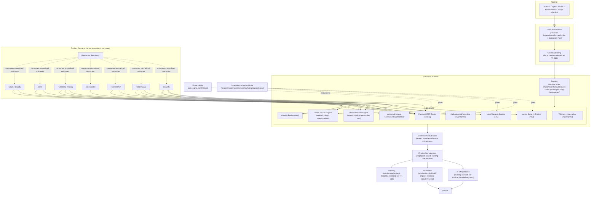
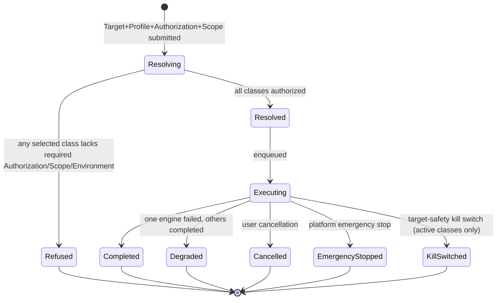
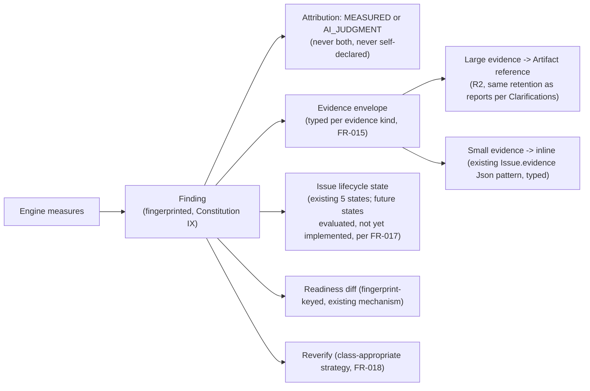
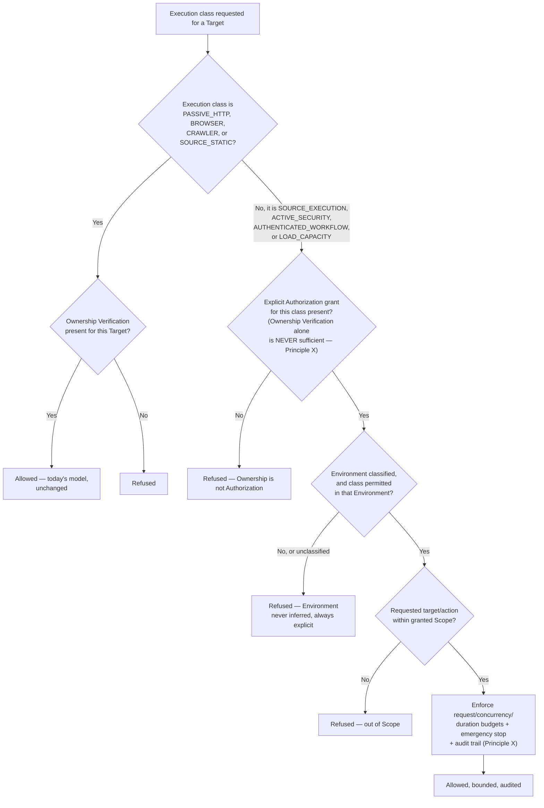
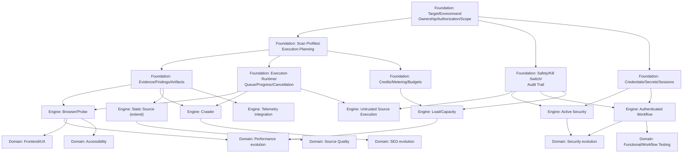

# Implementation Plan: Fahes Scan Platform Architecture v2

**Branch**: `006-scan-architecture-v2` | **Date**: 2026-10-07 | **Spec**: [spec.md](./spec.md)

**Input**: Feature specification from `specs/006-scan-architecture-v2/spec.md`

**Note on template fit**: this plan is for a master architecture / spec-of-specs, not an
implementing feature. It does not choose a language, write source code, or lay out a new
`src/`/`tests/` tree — there is nothing to implement. Where the template asks "how," this plan
answers at the architecture-decision level (reuse/extend/new classification, target shape,
bounded contexts, migration posture) and explicitly defers "how exactly" for any NEW SYSTEM
classification to that system's own future child spec, per this spec's FR-024–026 and
Constitution Principle XIV.

## Summary

Fahes's current scanning platform is a well-engineered, narrowly-scoped **passive, URL/source-
metadata audit platform**: 16 vendored, read-only capabilities across 5 fixed domains, a sound
BullMQ/credit/readiness/reverify foundation, and unusually careful safety engineering (SSRF
address classification, zip-slip/decompression-bomb defense, sandboxed-but-trusted-code execution,
prompt-injection-resistant AI assembly) for the narrow thing it does today. This plan's technical
approach is: **reuse the sound foundation, extend the parts that are mechanically close but
incomplete, and build new execution systems only where the current architecture's own threat
model genuinely does not extend** (active security, untrusted-code execution, customer-facing
load generation, and the authorization/scope/environment data model that none of those three can
safely exist without). Every new engine and domain is required to consume shared contracts
(Constitution Principle VIII) rather than re-implement them, and every rollout is additive and
non-regressing against the current production flow (FR-024, strict parallel-run, no cutover).

## Technical Context

**Language/Version**: Node.js >=22, TypeScript (existing monorepo standard) — this plan proposes
no new language or runtime; every future child spec inherits the existing stack unless its own
plan proves a specific incompatibility (none identified in this pass).

**Primary Dependencies**: Next.js 15/React 19 (web), Express (API), BullMQ/Redis (queues),
Prisma/PostgreSQL (persistence), Cloudflare R2 (object storage) — all existing and reused as-is.
No new primary dependency is introduced by this plan itself; specific future engines (e.g. a
deployed browser-pool service, a container-isolation runtime for untrusted code) will each
introduce their own dependency, chosen and justified in that engine's own plan, not here.

**Storage**: PostgreSQL (existing, extended with new tables per the data model — see
`data-model.md`), Redis (existing, queue/cache/rate-limit only, never system-of-record, per
existing Technology Constraints), R2 (existing, extended for new artifact types per FR-015/the
2026-10-07 Clarifications).

**Testing**: existing test stack (Vitest for unit/contract/integration, Playwright for Fahes's own
E2E) — this plan defines no new test suite itself; FR-014 of the constitution amendment requires
every future capability's own spec to declare its test approach as part of its Principle XIV
contract.

**Target Platform**: existing deployment targets (the five apps already described in
`PROJECT_MAP.md`) — this plan adds no new deployable unit itself; specific future engines (browser-
pool-as-a-service, an untrusted-code execution runtime) will each require their own deployable
unit, decided in that engine's own plan.

**Project Type**: N/A — this is a governance/architecture planning artifact, not a software
project with its own source tree. See Project Structure below for what this feature actually
produces.

**Performance Goals**: N/A for this plan itself (no running system). Per-execution-class
performance/duration targets are a Constitution Principle XIV requirement for each future child
spec, not a property of the master architecture.

**Constraints**: the five hard constraints this plan treats as binding on every future child spec:
(1) strict parallel-run with zero regression to current production `/scan` behavior (FR-024);
(2) no execution class may collapse Ownership Verification and Authorization (Constitution
Principle X); (3) no untrusted customer code may execute inside the existing trusted-capability
sandbox (Constitution Principle XI); (4) every new persisted/stored entity must be tenant-scoped
from creation (Constitution Principle XIII); (5) every new execution class must declare its full
Principle XIV contract before its own `/speckit-plan`.

**Scale/Scope**: this plan covers architecture decisions for 9 execution classes, 9 engines, and 8
product domains (see Execution-Class Matrix and Target Architecture below) across 28 future child
specs (7 Foundation + 8 Engine + 8 Domain + 5 Product-UX; see `roadmap.md` for the full
dependency-ordered list). It does not estimate customer-facing scale/load targets for any specific
future engine — those are each engine's own child spec's concern.

## Constitution Check

*GATE: evaluated against `.specify/memory/constitution.md` v1.2.0 (Principles I-XIV).*

| Principle | Check | Result |
|---|---|---|
| I. Skills Are Plugins | Does this plan force core code to name a concrete future capability? | PASS — every engine/domain defined here is reached through the existing discovery/registry model (extended, not bypassed); no core-code coupling proposed. |
| II. Vendored Forever | Does this plan introduce any runtime fetch of third-party capability code? | PASS — not applicable to a planning artifact; future child specs inherit this principle unchanged. |
| III. Deterministic Before Probabilistic | Does this plan's Evidence model (FR-009) let AI judgment masquerade as measurement? | PASS — FR-016/IX explicitly preserve attribution; no plan content contradicts III. |
| IV. No Single Point of AI Failure | Does this plan route any new AI usage outside `AIExecutor`? | PASS — not applicable; no new AI usage is introduced by this plan. |
| V. Untrusted Code Runs Isolated | Does this plan let untrusted code execute without proven isolation? | PASS — Principle XI (this plan's own constitution amendment) explicitly forbids reusing the existing sandbox for customer code; the Untrusted Source Execution Engine is classified NEW SYSTEM, deferred to its own child spec. |
| VI. Metered, Reconciled Cost | Does this plan propose any unmetered expensive operation? | PASS — FR-020 narrows metering scope deliberately but does not remove it; `LOAD_CAPACITY`/`SOURCE_EXECUTION` remain metered, others stay flat-priced and bounded as today. |
| VII. Verify Narrowly, Rescan Rarely | Does this plan's reverify model (FR-018) force a full rescan for every future class? | PASS — FR-018 explicitly preserves "never re-run a full module/scan where the execution class allows it" as a requirement on every future reverify class. |
| VIII. Engines Serve Domains | Does this plan let any domain own a private engine? | PASS — Target Architecture and the Execution-Class Matrix below assign every domain to shared engines; no domain-private engine is proposed. |
| IX. Evidence Is Reproducible | Does this plan's evidence model lose fingerprint identity across engines? | PASS — FR-016 makes fingerprint identity mandatory for every engine. |
| X. Authorization Is Not Ownership | Does this plan collapse ownership verification and authorization anywhere? | PASS — the Safety & Authorization Model below keeps them as two distinct entities (`TargetVerification` vs. `TargetAuthorization`) at every point. |
| XI. Untrusted Code Isolation | See V above. | PASS |
| XII. Long-Running Work | Does this plan assume every future execution class fits today's ~15-minute/30-second timeouts? | PASS — the Runtime/Queue Model below explicitly sizes `LOAD_CAPACITY`/`SOURCE_EXECUTION`/`AUTHENTICATED_WORKFLOW` outside those defaults. |
| XIII. Tenant Boundaries | Does this plan's data model introduce any entity reachable cross-tenant without scoping? | PASS — `data-model.md` scopes every new entity to `userId`/`scanId` at creation. |
| XIV. Capability Contract | Does this plan's Execution-Class Matrix declare all ten required fields per class? | PASS — see Execution-Class Matrix below; all nine classes carry all ten fields. |

**Gate result: PASS, no violations.** Complexity Tracking table is empty — no principle required an
exception in this pass.

## Current-State Architecture (condensed — full evidence in `docs/reviews/scan-audit-2026-10-07/`)

/scan accepts URL, GitHub-zipball repository (default branch only, no ref pinning today), or
ZIP archive (guarded against zip-slip/bombs/symlinks before any byte is written or credit
charged). Five fixed domains (Security/Performance/UI/Testing/SEO), flat credit pricing (20/20/
25/20/10, bundled 80 vs. 95), debited directly at scan creation against locked credit lots.
Three-phase BullMQ worker execution (Perf+Sec+SEO, then UI after an optional questionnaire pause,
then Testing) runs 16 vendored capabilities against a shared `AuditCapability` contract exposing
guarded fetch (SSRF-protected across 4 layers), confined source read, and a browser-page hook that
always rejects today because no cross-process browser-pool service is deployed. All 16
capabilities are passive/read-only; none executes customer code, sends an injection payload, or
authenticates to a target. A single per-module AI call runs after code-layer checks (only the UI
domain has an AI-layer capability today), with labelled-segment prompt-injection defense and
graceful `AI_MODE=disabled` degradation. Findings carry a deterministic fingerprint consumed by
both the readiness engine (config-driven per-module thresholds, fingerprint-based regression
diff) and reverify (single-capability, 30-second, stateless re-check). An internal k6 harness
exists but is wired exclusively to Fahes's own auth/seed-user model, not a customer-facing
capability. No authenticated scanning, workflow/business-logic testing, SAST, visual regression,
accessibility testing, or customer telemetry ingestion exists anywhere today.

## Target Architecture



### Scan lifecycle sequence (unchanged happy path, extended gate)

```mermaid
sequenceDiagram
    participant U as User
    participant API as API
    participant PLAN as Execution Planner
    participant AUTH as Authorization Check
    participant Q as Queue
    participant W as Worker/Engine
    U->>API: Create Target + select Profile/domains (+ Authorization grant, if active class selected)
    API->>PLAN: Resolve Execution Plan
    PLAN->>AUTH: For each selected execution class, check Authorization + Scope + Environment
    AUTH-->>PLAN: Grant or refuse (per class)
    PLAN->>API: Resolved, immutable Execution Plan
    API->>API: Quote (flat or narrow-metered per FR-020), debit
    API->>Q: Enqueue (existing scan-phase queue for bounded classes;\na new per-class queue for long-running classes per FR-012/Constitution XII)
    Q->>W: Dispatch
    W->>W: Execute within declared contract (timeout/isolation/evidence per Principle XIV)
    W->>API: Findings (fingerprinted) + Evidence/Artifacts
    API->>U: Report, Readiness, Reverify (as today, extended)
```

### Execution-plan lifecycle



### Finding/evidence lifecycle



### Authorization/safety decision flow



### Future engine dependency graph



## Reuse / Extend / New Matrix

| Subsystem | Classification | Evidence | Rationale |
|---|---|---|---|
| BullMQ queue skeleton | **REUSE**, pattern **EXTEND** for new classes | `packages/config/src/queues.ts` | Named-queue-per-concern pattern reused; long-running classes get their own new queue instances following the same pattern, not a new queue technology. |
| Credit ledger (debit/refund/lots) | **REUSE** | `apps/api/src/services/credits/debit.ts` | Mechanics unchanged; FR-020 narrows which classes use variable pricing, not how the ledger works. |
| Pricing function (`AREA_COST`/`quoteAreas`) | **EXTEND** | `packages/config/src/pricing.ts` | Flat-pricing mechanism reused for most classes; `LOAD_CAPACITY`/`SOURCE_EXECUTION` need new metered-pricing logic consuming `CapabilityExecution.costMicros`. |
| Readiness threshold/diff/verdict engine | **EXTEND** | `apps/worker/src/readiness/{verdict,diff}.ts` | Aggregation logic is generic; the `ModuleType` enum and `READINESS_THRESHOLDS`/`MODULE_LABEL` tables need new entries per new domain — mechanical, not a rewrite. |
| Reverify single-check dispatch | **EXTEND** | `apps/worker/src/reverify/runner.ts` | Dispatch-by-checkId pattern reused; new reverify classes (browser, source, workflow, security, load) need new context/timeout/statefulness handling per FR-018. |
| Capability-SDK contract (`AuditCapability`) | **EXTEND** | `packages/capability-sdk/src/contract.ts` | Core shape (id/module/layer/canRun) reused; needs new optional fields for execution-class, authorization requirement, and long-running progress/cancellation hooks that today's short-job-only contract lacks. |
| `apps/probe-pool` (browser library) | **EXTEND** (deploy as a service) | `apps/probe-pool/src/browser/pool.ts` | Code exists; needs a cross-process transport and wiring into the worker's context factory — the single highest-leverage near-term change. |
| `apps/sandbox-runner` | **REUSE** for its existing purpose; **NEW SYSTEM** needed for untrusted customer-code execution | `apps/sandbox-runner/src/host/server.ts` | Reused unchanged for operator-installed-capability dispatch; Constitution Principle XI forbids extending it for customer code — a new system with container/VM-grade isolation is required for that. |
| SSRF/safe-net address classification | **REUSE** | `packages/safe-net/src/address-rules.ts` | Directly reusable by every future engine that makes outbound requests (including Active Security, within its granted Scope). |
| Archive safety (`packages/safe-archive`) | **REUSE** | `packages/safe-archive/src/guard.ts` | Directly reusable for any future engine that accepts uploaded content. |
| Multi-tenant ownership scoping | **REUSE** pattern, **EXTEND** to new entities | Prisma schema `userId` scoping | Pattern reused; every new entity in `data-model.md` must apply it from creation (Constitution Principle XIII). |
| AI-layer assembly (labelled-segment, one-call-per-module) | **REUSE** | `apps/worker/src/module-runner/ai-layer.ts` | Directly reusable by any new domain that wants an AI-interpretation layer; no redesign needed. |
| k6 load-testing harness | **NOT REUSABLE for this purpose** — **NEW SYSTEM** for customer-facing load | `load-testing/RUNBOOK.md` | Wired to Fahes's own internal auth/seed model; a customer-facing Load/Capacity Engine is a new system, not an extension of this harness. |
| Crawler (multi-page) | **NEW SYSTEM** | — (does not exist) | No current capability performs a true multi-page crawl. |
| Active Security Engine | **NEW SYSTEM** | — (does not exist) | No current capability sends any payload; requires the Safety/Authorization foundation first. |
| Authenticated Workflow Engine | **NEW SYSTEM** | — (does not exist) | No current capability authenticates to a target or models a multi-step workflow. |
| Telemetry Integration Engine | **NEW SYSTEM** | — (does not exist) | No current ingestion path for customer-side APM/RUM/OpenTelemetry data. |
| Authorization/Scope/Environment data model | **NEW SYSTEM** (closest existing primitive: `ControlLevel`/`TargetVerification`, which is EXTENDED conceptually but not sufficient alone) | Prisma schema `ControlLevel`/`TargetVerification` | Proves ownership only; a new, separate model is required for Authorization per Constitution Principle X. |

## Execution-Class Matrix (Constitution Principle XIV contract, all ten fields, all nine classes)

All three current intake modes map onto the two existing execution classes explicitly: a URL
Target or an uploaded ZIP archive both resolve to `PASSIVE_HTTP` for their fetch-based capabilities
and `SOURCE_STATIC` for their source-based capabilities (an archive is source whether it arrived as
a ZIP or a GitHub zipball); a repository Target resolves to `SOURCE_STATIC` only (no served page to
fetch). No intake mode requires a new execution class by itself — this is what makes today's entire
production surface fit inside the first two matrix rows below.

| Class | Trust boundary | Input | Output | Stateful? | Duration | Isolation | Network | Credential | Required Authorization | Environment restriction | Queue placement | Evidence | Cancellation | Reverify |
|---|---|---|---|---|---|---|---|---|---|---|---|---|---|---|
| `PASSIVE_HTTP` | Trusted code, untrusted data | Target URL/source | Findings | No | Seconds | Process-level (existing) | SSRF-guarded fetch | None | passive | Any (ownership only) | Existing scan-phase queue | HTTP transaction, source location | Existing (scan-phase) | Existing single-check, 30s |
| `BROWSER` | Trusted code, untrusted rendered data | Target URL | Findings, screenshots | No (per-page) | Seconds-minutes | Process + browser-context isolation | SSRF-guarded via proxy | None | browser-interactive | Any (ownership only) | Existing scan-phase queue once deployed | Screenshot, DOM, accessibility tree | Existing, extended for open browser session | New browser-reverify class |
| `CRAWLER` | Trusted code, untrusted data | Target origin | Site topology, per-page findings | Yes (crawl frontier) | Minutes | Process-level, bounded page count | SSRF-guarded fetch, same-origin by default | None | passive (crawl is still read-only) | Any (ownership only) | New dedicated queue (bounded but longer than single-page) | Per-page HTTP/source evidence, topology graph | New: must stop mid-crawl cleanly | Per-page, reuses PASSIVE_HTTP style |
| `SOURCE_STATIC` | Trusted code, untrusted data | Attached source tree | Findings | No | Seconds-minutes | Confined read (existing) | None | None | passive | Any (ownership only) | Existing scan-phase queue | Source location, code snippet | Existing | Existing, with reattached-source caveat (today's gap) |
| `SOURCE_EXECUTION` | **Untrusted code execution** | Attached source tree | Build/test/lint output, findings | Yes (build state) | Minutes-tens of minutes | **Container/VM-grade (new, Principle XI)** | Explicit, minimal, justified per capability | None reachable from workload | passive (but execution itself is high-risk — see Constitution XI) | Any (ownership only; risk is to Fahes's own infra, not the target) | New dedicated queue, long-running | Build logs, test results, source location | New: must kill the execution environment, not just the job record | New class: may need to re-run the whole build, not one check |
| `ACTIVE_SECURITY` | Adversarial — payloads sent to target | Target + Scope + payload class | Findings, reproduction evidence | Varies by test | Seconds-minutes per test | Process-level, egress tightly scoped to Scope | Scoped, allowlisted, budgeted | Session/account if testing authenticated surfaces | active-security | staging or high-impact-staging-only (never production by default — Principle X) | New dedicated queue, rate/concurrency budgeted | HTTP request/response pair, payload used, response diff | New: target-safety kill switch, not just user cancellation | New class: re-run one specific test, not the suite |
| `AUTHENTICATED_WORKFLOW` | Authenticated, stateful | Target + Scope + credentials/roles | Findings, workflow trace | Yes (session/workflow state) | Minutes | Process + isolated session per execution | Scoped to target + Scope | Test-account credential, scoped and time-limited | authenticated | staging strongly preferred; production requires explicit high-impact-staging-only-equivalent grant | New dedicated queue | Workflow step trace, request/response per step | New: must tear down session cleanly | New class: re-run one scenario step or the whole scenario |
| `LOAD_CAPACITY` | Generates load against target | Target + Scope + load profile | Metrics (p50/p95/p99, throughput, error rate) | Yes (ramp state) | Minutes-hours | Process-level, dedicated generator pool | Scoped, rate-budgeted, metered | None (unless authenticated load is requested, then as Authenticated Workflow) | load | staging only by default; production requires explicit high-impact-staging-only-equivalent grant | New dedicated queue, metered | Time-series metrics, load curve, generator logs | New: must stop load generation immediately on any stop signal | New class: typically re-run the whole profile, not a single point |
| `TELEMETRY` | Ingests customer-provided data | Customer-pushed or customer-API-pulled metrics | Normalized findings/metrics | No (ingestion is stateless per batch) | Ongoing/continuous | None execution-side (data ingestion only) | Inbound from customer's own integration | Customer-issued API credential for their own telemetry system | passive (ingestion, not testing) | Any (no execution against the target at all) | Existing or lightweight new ingestion path | Time-series, external metric reference | N/A (no execution to cancel; stop = disconnect integration) | N/A (re-ingest, not re-test) |

**Amendment (recorded by F01's closure pass, `specs/007-foundation-target-authorization-scope/`,
2026-10-07)**: the "high-impact-staging-only-equivalent grant" language above for
`ACTIVE_SECURITY`/`AUTHENTICATED_WORKFLOW`/`LOAD_CAPACITY` was this master spec's own placeholder
for a production-permitting mechanism within the hierarchical authorization taxonomy FR-004
originally proposed. F01 superseded that taxonomy with independent per-execution-class grants
(its own FR-005) and, in doing so, did not carry forward an equivalent production-permitting
mechanism for these three classes — F01's FR-015a makes production absolutely forbidden for them
in its v1 model, pending a deliberate future amendment to F01 itself (not to this document). A
reader of this table alone should not infer that production is currently obtainable for these
three classes by any grant F01's own `createAuthorization` contract can create today. This
table's cells are left as historical placeholder record, not rewritten, per this master spec's own
living-document governance (the Edge Cases section's "surface a proposed amendment rather than
silently diverge" rule) — the authoritative, current rule lives in F01. `SOURCE_EXECUTION`'s row
above ("Any (ownership only; risk is to Fahes's own infra, not the target)") is unaffected by this
amendment and remains accurate — F01's FR-015a explicitly exempts `SOURCE_EXECUTION` from its
production prohibition for exactly this reason.

## Safety & Authorization Model (conceptual)

Two entities, never collapsed (Constitution Principle X):

- **Ownership Verification** (`TargetVerification`, existing, extended conceptually not
  structurally) answers "does this user control this Target." Unlocks nothing beyond today's
  passive classes (`PASSIVE_HTTP`, `BROWSER`, `CRAWLER`, `SOURCE_STATIC`) by itself.
- **Authorization** (`TargetAuthorization`, new) answers "is this user allowed to run this
  specific execution class against this Target." Required, in addition to Ownership Verification,
  for `SOURCE_EXECUTION`, `ACTIVE_SECURITY`, `AUTHENTICATED_WORKFLOW`, `LOAD_CAPACITY`.

Every Authorization grant carries: the execution class(es) it covers, a Scope (FR-005), an
Environment restriction (a grant for staging does not cover production, ever, by default), request/
concurrency/duration budgets, and references an audit trail (`ExecutionAuditEvent`, new) of every
attempt made under it. An emergency stop and a target-safety kill switch (FR-022) are reachable
independent of normal user cancellation for any execution running under an active-class
Authorization.

## Runtime / Queue Model

Today's single `webaudit-scan-phase` queue (4 concurrent workers, `attempts:1`, ~15-minute scan-
wide timeout) remains exactly as-is for the four classes that already fit it
(`PASSIVE_HTTP`/`SOURCE_STATIC` today, `BROWSER`/`CRAWLER` once their engines exist, since all four
are bounded-duration and either stateless or cheaply retryable). Four new classes need dedicated
queues, each sized to its own duration/statefulness per the Execution-Class Matrix above:
`SOURCE_EXECUTION` (long-running, stateful build), `ACTIVE_SECURITY` (budgeted, rate-limited, needs
the kill switch), `AUTHENTICATED_WORKFLOW` (stateful session), `LOAD_CAPACITY` (longest-running,
metered). This mirrors the existing platform's own precedent of giving `webaudit-reverify` its own
queue specifically so an audit backlog cannot starve it (Constitution Principle XII) — the new
queues exist for the same reason, scaled to four new classes instead of one feature.

## Migration Strategy

Per FR-024 (strict parallel-run, no cutover window, accepted 2026-10-07): the current flow
(`Target -> Scan -> Phase -> Capability -> Finding -> Report`) and the future flow (`Target ->
Authorization -> Scan Profile -> Execution Plan -> Engines -> Evidence -> Normalized Findings ->
Report -> Reverify -> Readiness`) coexist structurally, not as two separate systems: the future
flow's additional steps (Authorization, Scope resolution) are no-ops for any Execution Plan that
contains only today's five domains and passive classes — Ownership Verification alone continues to
satisfy them, exactly as today. The compatibility boundary is therefore at the Execution Plan: a
plan containing only `PASSIVE_HTTP`/`SOURCE_STATIC` classes (today's entire production surface) is
indistinguishable in behavior from today's `capabilitySnapshot`-resolved scan. A plan containing
any new class is additive — gated behind its own Authorization requirement, never retrofitted onto
an existing scan path. No adapter/compatibility shim is needed for the current five domains because
nothing about their behavior changes; adapters are needed only where a specific future child spec's
own plan shows a genuine incompatibility with a shared contract (per FR-026), and that child spec
designs its own adapter at that time.

## Bounded Contexts

| Context | Owns | Does not own |
|---|---|---|
| Target Management | Target identity, canonical value normalization | Authorization, Scope (separate context below) |
| Authorization & Scope | TargetAuthorization, ScopeDefinition, Environment classification | Ownership Verification (Target Management owns the existing `TargetVerification`) |
| Scan Planning | ScanProfile, ExecutionPlan resolution | Engine execution itself (Execution Runtime owns that) |
| Execution Runtime | Queues, Execution/ExecutionStep records, progress, cancellation | Evidence content (Evidence & Artifacts owns that) |
| Evidence & Artifacts | Evidence envelopes, Artifact storage/retention | Finding lifecycle decisions (Finding Lifecycle owns that) |
| Finding Lifecycle | Issue states, fingerprint identity, reverify dispatch | Readiness aggregation (Readiness owns that, consuming Finding Lifecycle's normalized output) |
| AI Interpretation | The existing one-call-per-module, labelled-segment AI assembly (`ai-layer.ts`); judgment findings layered on code-layer findings | Measurement itself (every code-layer finding is produced by an Engine, never by this context); attribution assignment (Finding Lifecycle's runner assigns `MEASURED`/`AI_JUDGMENT`, not this context) |
| Billing / Metering | Credit ledger, flat and narrow-metered pricing, `ResourceUsage` | Execution scheduling (Execution Runtime owns that) |
| Readiness | Threshold/diff/verdict, baseline linkage | Individual domain scoring logic (each domain/engine owns its own score) |
| Credentials / Sessions | CredentialBinding, SessionBinding, lifecycle/rotation | Target-level OAuth integration tokens (existing token vault, a distinct, platform-integration concern) |
| Observability | Per-engine telemetry, engine health | Customer-facing reporting (Evidence & Artifacts / Finding Lifecycle own report content) |

No new deployable *service* is proposed by this plan beyond what specific engines already require
for their own isolation reasons (a deployed browser-pool service for `BROWSER`; a container/VM
runtime for `SOURCE_EXECUTION`). Bounded contexts above are logical ownership boundaries within the
existing API/worker split, not a mandate to split every context into its own microservice.

## Project Structure

### Documentation (this feature)

```text
specs/006-scan-architecture-v2/
├── spec.md                       # Feature specification (done)
├── checklists/requirements.md    # Spec quality checklist (done, 16/16 passing)
├── plan.md                       # This file
├── research.md                   # Phase 0 output
├── data-model.md                 # Phase 1 output — full entity list
├── contracts/                    # Phase 1 output — conceptual interface contracts
│   ├── shared-platform-contracts.md
│   ├── execution-class-contract-template.md
│   └── engine-contracts-summary.md
├── quickstart.md                 # Phase 1 output — validation guide for future child specs
├── roadmap.md                    # Phase 8 output — spec-of-specs dependency-ordered roadmap
├── decisions.md                  # Architecture Decision Log
└── tasks.md                      # Phase 2 output (speckit-tasks — planning/decomposition tasks only)
```

### Source Code (repository root)

Not applicable. This feature produces no application source code, no new deployable service, no
database migration, and no API change. Every "Source Code" layout decision is deferred to the
specific future child spec that implements a given engine or domain, at which point that spec's
own plan.md will document the concrete paths (e.g. `apps/worker/src/orchestrator/` for a new
execution-class dispatcher, `packages/capability-sdk/` for a contract extension) the way every
other existing feature spec under `specs/00N-*/` already does.

**Structure Decision**: documentation-only structure as shown above; no source tree is proposed or
modified by this plan.

## Complexity Tracking

*No entries — the Constitution Check above found zero violations requiring justification.*
