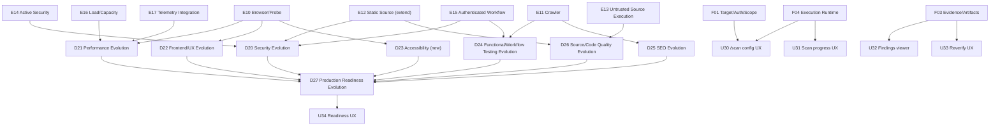

# Spec-of-Specs Roadmap: Fahes Scan Platform Architecture v2

Dependency-ordered list of future child specs. The triggering task's suggested four-tier structure
(Foundation/Engine/Domain/Product-UX) is retained because the dependency analysis below actually
confirms that shape — but the specific spec list is derived from this plan's own Target
Architecture, Execution-Class Matrix, and Bounded Contexts, not accepted as given. One suggested
spec ("Billing/Credits UX") was dropped after dependency analysis showed no standalone need (see
Notes). The Passive HTTP Engine needs no child spec — it is fully implemented and classified REUSE.

## Foundation specs (7)

| ID | Name | Depends on | Purpose | Why separate | Must NOT own |
|---|---|---|---|---|---|
| F01 | Target / Environment / Ownership / Authorization / Scope | none | Design `TargetEnvironment`, `TargetAuthorization`, `ScopeDefinition` as real, migratable Prisma entities; finalize the authorization-tier taxonomy with product input per the constitution's `TODO(ACTIVE_SECURITY_AUTHORIZATION_MODEL)` | This is the one entity set every other new capability's safety model depends on (Constitution Principle X); getting it wrong once is cheaper than getting it wrong in 8 downstream specs | Any specific engine's execution logic |
| F02 | Scan Profiles / Execution Planning / Orchestration | F01 | Design `ScanProfile`, `ScanPlan`/Execution Plan resolution, and the orchestrator extension that resolves Target+Authorization+Scope+Profile into an immutable plan | The resolution step is shared by every future engine; duplicating it per engine would violate Constitution Principle VIII | Engine execution itself |
| F03 | Evidence / Findings / Artifacts | F02 | Design typed `Evidence` envelopes, `Artifact` storage/retention, and resolve the issue-lifecycle future-states question (FR-017) in detail | Every engine needs this before it can report a single finding; evidence/retention design mistakes are expensive to unwind later (cf. the existing staged-upload retention gap) | Finding-identity computation itself (Finding Lifecycle context, extended in place, owns that) |
| F04 | Execution Runtime / Queue / Progress / Cancellation | F02 | Design the new dedicated queues (per Constitution Principle XII), the progress-event hierarchy (FR-021), and the three-way stop distinction (FR-022) | Every long-running engine (Source Execution, Active Security, Authenticated Workflow, Load/Capacity) needs this before it can exist; getting cancellation/kill-switch semantics wrong is a safety defect, not a UX defect | Any specific engine's own execution logic |
| F05 | Credentials / Secrets / Session Management | F01 | Design `CredentialBinding`, `SessionBinding`, their lifecycle/rotation/revocation, distinct from the existing GitHub OAuth token vault | Authenticated Workflow and any future authenticated class cannot exist without this; security-critical, deserves its own focused review | Target-testing logic itself |
| F06 | Credits / Metering / Resource Budgets | F02 | Extend `AREA_COST`/`quoteAreas` for the narrow metering scope (FR-020: `LOAD_CAPACITY`/`SOURCE_EXECUTION` only), wire `CapabilityExecution.costMicros`-equivalent fields for non-AI compute | Billing correctness is Constitution Principle VI; isolating this from engine logic keeps cost reconciliation auditable in one place | Engine execution logic; budget *enforcement* at runtime (Execution Runtime owns enforcing the budget F06 defines) |
| F07 | Safety / Kill Switch / Execution Audit Trail | F01 | Design `ExecutionAuditEvent`, the emergency-stop and target-safety-kill-switch mechanisms, and the request/concurrency/duration budget enforcement hooks | This is the spec that makes Active Security, Authenticated Workflow, and Load/Capacity safe to build at all — it must exist and be implemented before any of those three engines' specs proceed past their own `/speckit-plan`, per Constitution Principle XIV | Any specific engine's test logic |

## Engine specs (8 — Passive HTTP Engine needs none, already REUSE)

| ID | Name | Depends on | Purpose | Why separate | Must NOT own |
|---|---|---|---|---|---|
| E10 | Browser / Probe Engine | F03, F04 | Deploy `apps/probe-pool` as a real cross-process service; wire `pageProvider` into the worker's `contextFactory` | Highest-leverage, lowest-risk engine — activates 4+ already-written capabilities with no new capability code; deliberately kept implementation-focused and separate from any domain's capability work | Any domain's interpretation of what a rendering measurement means (that stays in each domain's own evolution spec) |
| E11 | Crawler Engine | F03, F04 | Design multi-page discovery/traversal, bounded by page-count and same-origin-by-default rules | No current capability does this at all; genuinely new surface area, deserves isolated review of its own request-budget and politeness rules | Per-page measurement depth (delegates to Passive HTTP/Browser per page) |
| E12 | Static Source Analysis Engine (extend) | F03 | Extend today's regex/manifest-level `dependency-scanner`/`bundle-analyzer`/`css-analyzer` pattern toward AST-based analysis and a live dependency-advisory feed | Lower-risk extension of an existing, working engine; separated from Untrusted Source Execution specifically because it remains read-only | Code execution (Untrusted Source Execution Engine owns that) |
| E13 | Untrusted Source Execution Engine | F01, F04, F07 | Design and select the container/VM-grade isolation mechanism (the constitution's `TODO(UNTRUSTED_EXECUTION_MECHANISM)`) for running a customer's own install/build/lint/test | The single highest-risk new engine from a platform-security perspective; must not inherit any assumption from the existing trusted-capability sandbox (Constitution Principle XI) | Any of today's vendored-capability dispatch (that stays on `apps/sandbox-runner` unchanged) |
| E14 | Active Security Engine | F01, F05, F07 | Design the first adversarial-payload-sending capability (payload safety classification, response-diffing, target-allowlist enforcement) | The highest-risk engine from a third-party-harm perspective; cannot proceed past its own `/speckit-plan` until F01 and F07 are implemented, per Constitution Principle XIV | Authorization/scope decisions themselves (F01/F07 own those; this engine only enforces them) |
| E15 | Authenticated Workflow Engine | F01, F05, F07 | Design multi-step, session-bound, role-aware test execution | Needs F05's credential/session model and F07's safety model before any capability can authenticate to a target at all | Credential storage itself (F05 owns that) |
| E16 | Load / Capacity Engine | F06, F07 | Design a customer-facing load-generation engine, explicitly NOT built by extending the existing internal k6 harness | Needs F06's metering and F07's kill-switch/budget enforcement; the internal-vs-customer-facing distinction (Clarified 2026-10-07) makes this a ground-up design, not a harness extension | Internal platform capacity testing (the existing `load-testing/` harness stays as-is, untouched) |
| E17 | Telemetry Integration Engine | F03 | Design customer-side APM/OpenTelemetry/RUM ingestion and normalization into the Evidence model | Lowest-risk new engine (ingestion only, no execution against the target) but needs F03's typed Evidence model first | Any execution against the target (explicitly out of scope for this engine by definition) |

## Domain specs (8)

| ID | Name | Depends on | Purpose | Why separate |
|---|---|---|---|---|
| D20 | Security Evolution | E12, E14, E15 | Extend the Security domain to consume Active Security and Authenticated Workflow findings alongside today's passive checks | Domain-level scoring/readiness-threshold tuning is a different concern from engine implementation |
| D21 | Performance Evolution | E10, E16, E17 | Extend Performance to consume Browser-based CWV, Load/Capacity metrics, and Telemetry data | Same reasoning — domain consumption, not engine building |
| D22 | Frontend/UX Evolution | E10 | Extend Design/UI to consume real rendering (overflow, tap-targets) once E10 ships, plus design visual-regression as a new capability within this domain | — |
| D23 | Accessibility (new domain) | E10 | Stand up accessibility as its own domain (today it does not exist even conceptually in the five-domain model), consuming Browser-rendered DOM | Accessibility was never one of today's five domains; this is a genuinely new product surface, not an extension |
| D24 | Functional/Workflow Testing Evolution | E11, E15 | Extend Testing beyond broken-link checking toward real multi-page and authenticated-workflow testing | — |
| D25 | SEO Evolution | E11 | Extend SEO to consume multi-page crawl data (robots/sitemap/duplicate-metadata/internal-linking) | — |
| D26 | Source/Code Quality Evolution | E12, E13 | Extend Source Quality to consume AST-based static analysis and (eventually) customer test-execution results | — |
| D27 | Production Readiness Evolution | D20-D26 (any subset that has shipped) | Extend `ModuleType`/`READINESS_THRESHOLDS`/`MODULE_LABEL` for each new domain as it ships | Must follow, never precede, the domains it aggregates — readiness consumes normalized outcomes (Constitution Principle VIII), so it cannot be planned in detail until at least one new domain exists to aggregate |

## Product-experience specs (5 — one dropped after dependency analysis)

| ID | Name | Depends on | Purpose | Why separate |
|---|---|---|---|---|
| U30 | `/scan` configuration UX | F01, F02 | Design the Target+Profile+Authorization+Scope selection surface beyond today's thin launcher | Cannot be meaningfully designed before F01/F02 exist — there is nothing yet to configure |
| U31 | Scan progress UX | F04 | Design the UI for the new progress hierarchy and the three-way stop distinction | Depends on F04's progress/cancellation model existing first |
| U32 | Findings/Evidence viewer | F03 | Design how a report renders typed evidence (screenshots, traces, load curves) instead of today's flat finding list | Depends on F03's typed Evidence model existing first |
| U33 | Reverify/Remediation UX extension | F03, and whichever engine spec introduces a new reverify class | Design the UI for non-HTTP reverify classes (e.g. "re-run this browser check," "re-run this workflow scenario") | Needs a real new reverify class to design against, not only the abstract FR-018 requirement |
| U34 | Readiness/Baseline UX extension | D27 | Design the UI for a readiness report once new domains contribute to it | Follows D27 for the same reason D27 follows the domain specs |

**Dropped**: "Billing/Credits UX" — dependency analysis found no standalone need. FR-020's narrow
metering scope (only `LOAD_CAPACITY`/`SOURCE_EXECUTION`) means the existing credit-display UI
needs, at most, a small extension inside U30 (showing a metered estimate instead of a flat one for
those two classes specifically) — not enough surface area to justify its own child spec. If a
future child spec discovers otherwise, it should be re-added with the evidence that justifies it.

## Dependency graph

See `plan.md`'s "Future engine dependency graph" Mermaid diagram for the foundation-to-engine
edges. Domain and product-UX dependencies not already shown there:

## Recommended planning order

1. **F01** (Target/Environment/Ownership/Authorization/Scope) — recommended next spec. Nothing
   else in this roadmap can be planned in concrete detail until the authorization-tier taxonomy and
   its data model are real, reviewed artifacts, not this master plan's placeholders.
2. F07 (Safety/Kill Switch/Audit Trail) — can be planned in parallel with F01 once F01's entities
   are stable enough to reference, since F07 depends only on F01.
3. F02, F04, F05 — can be planned in parallel once F01 is done; each depends only on F01 (F05) or
   F01+F02 (F04) per the graph.
4. F03, F06 — depend on F02; plan after F02.
5. E10 (Browser/Probe) — can start as soon as F03+F04 are done; recommended as the first *engine*
   spec because it is the lowest-risk, highest-leverage one (activates existing dead capabilities,
   introduces no new safety model).
6. Remaining engine specs (E11-E17) in roughly risk-ascending-then-descending order: E12
   (low-risk extension) before E11 (new but passive) before E17 (new, low-risk, ingestion-only)
   before E16/E15/E14/E13 (the four that each need F05/F06/F07 and carry real safety stakes).
7. Domain specs (D20-D27) only after their prerequisite engines exist; D27 last among domains.
8. Product-UX specs (U30-U34) interleaved after their specific prerequisite, not held until the end
   — e.g. U30 can be planned as soon as F01/F02 ship, well before most engines exist.

## Implementation order (once planning stabilizes)

Mirrors the planning order above, with one additional rule: **no engine or domain spec begins
`/speckit-implement` before F07 (Safety/Kill Switch/Audit Trail) is itself implemented**, if that
engine/domain is `ACTIVE_SECURITY`, `AUTHENTICATED_WORKFLOW`, `LOAD_CAPACITY`, or
`SOURCE_EXECUTION` — this is the concrete, binding version of Constitution Principle XIV's
"complete contract before implementation" rule for the four highest-risk classes specifically.
