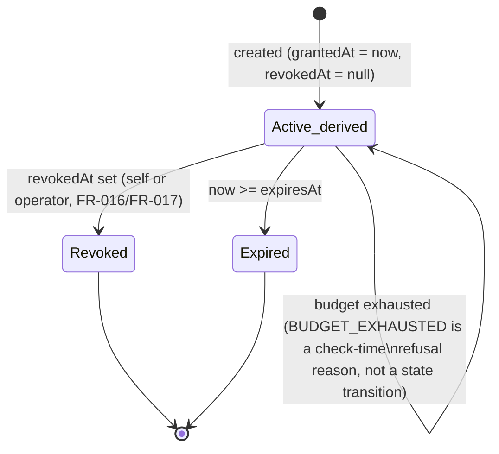
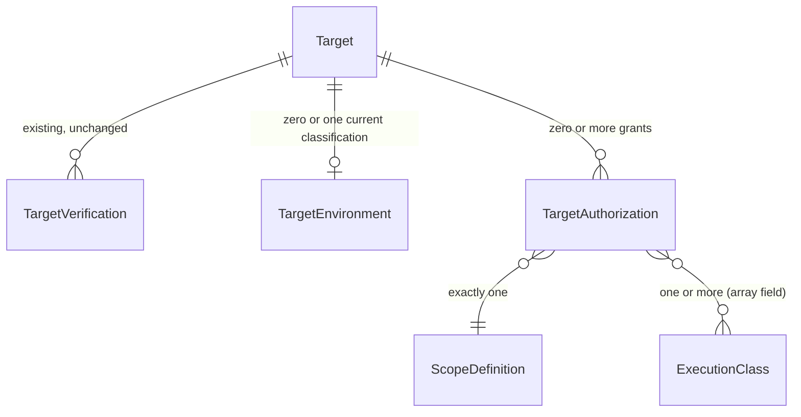

# Phase 1 Data Model: Foundation Spec 01 — Target / Environment / Ownership / Authorization / Scope

Unlike the parent spec's `data-model.md` (explicitly illustrative, deferred to this spec for
finalization), this is the real, intended schema — the actual Prisma migration a future
`/speckit-implement` pass runs is this document transcribed, not redesigned. No migration is run by
this planning pass (per `spec.md`'s Assumptions and SC-004).

All three entities attach to the existing `Target` model (`apps/api/prisma/schema.prisma:424-445`)
with **zero semantic changes** to it — no authorization state, environment state,
verification-derived state, permission flag, or any other business-meaning field is added to
`Target` or `TargetVerification`.

**Prisma feasibility note (closure-pass finding, proven not assumed)**: Prisma 6.1.0 requires a
relation to be declared on both sides of a one-to-many pair. Running `prisma validate` against an
isolated copy of the real schema with this document's `TargetEnvironment`/`TargetAuthorization`
models appended, exactly as drafted, produces:

```
error: Error validating field `target` in model `TargetEnvironment`: The relation field `target`
on model `TargetEnvironment` is missing an opposite relation field on the model `Target`.
error: Error validating field `target` in model `TargetAuthorization`: The relation field `target`
on model `TargetAuthorization` is missing an opposite relation field on the model `Target`.
Validation Error Count: 2
```

The minimum fix — adding exactly two structural back-relation fields to `Target`, following the
identical pattern its two existing one-to-many relations already use — makes the schema valid
(confirmed by re-running `prisma validate` after the addition: `The schema ... is valid`). `Target`
therefore gains these two lines, and only these two lines, as part of this spec's migration:

```prisma
model Target {
  // ...all existing fields, unchanged...
  user          User                 @relation(fields: [userId], references: [id], onDelete: Cascade)
  verifications TargetVerification[]
  scans         Scan[]
  targetEnvironment    TargetEnvironment?       // NEW — structural back-relation only, added by this spec
  targetAuthorizations TargetAuthorization[]    // NEW — structural back-relation only, added by this spec
  // ...existing @@unique/@@index, unchanged...
}
```

Both new fields are relation-only (no column, no default, no business logic) and are never read by
any of `Target`'s existing 16 capabilities or any current scan-creation/intake code path — they
exist only because Prisma's schema validator requires them, exactly as `verifications`/`scans`
already exist for the same structural reason. This is the one, precise, proven exception to "no
field is added to `Target`" — not a semantic change, and not a guess: see FR-021's corresponding
fix in `spec.md` for the normative requirement text. No migration was generated or applied by this
closure pass; the validation above ran against a temporary, untracked schema copy that was deleted
immediately after use, and the real `apps/api/prisma/schema.prisma` was never modified.

## ExecutionClass (new enum)

```prisma
enum ExecutionClass {
  BROWSER
  CRAWLER
  SOURCE_EXECUTION
  ACTIVE_SECURITY
  AUTHENTICATED_WORKFLOW
  LOAD_CAPACITY
}
```

Mirrors the parent spec's FR-008 placeholder set, narrowed to the classes that actually require
`TargetAuthorization` beyond Ownership Verification (per the parent's own Safety & Authorization
Model: `PASSIVE_HTTP`/`SOURCE_STATIC` never require one and are therefore not members of this
enum — they are gated by Ownership Verification alone, unchanged by this spec). A future engine
spec that justifies a new execution class requiring Authorization extends this enum additively;
removing or renarrowing a value is a breaking change to every grant that lists it and therefore
requires the same amendment bar as a constitution change (FR-005's own framing).

## TargetEnvironmentClassification (new enum)

```prisma
enum TargetEnvironmentClassification {
  PRODUCTION
  STAGING
  DEVELOPMENT
}
```

## TargetEnvironment (new model)

```prisma
model TargetEnvironment {
  id             String                          @id @default(cuid())
  targetId       String
  classification TargetEnvironmentClassification
  classifiedAt   DateTime                         @default(now())
  classifiedBy   String // userId

  target Target @relation(fields: [targetId], references: [id], onDelete: Cascade)

  /// FR-001: a Target has zero or one *current* classification. Reclassifying
  /// replaces this row's `classification`/`classifiedAt`/`classifiedBy` in
  /// place (an UPDATE, not a new row) — there is deliberately no history table
  /// here, unlike `TargetVerification`'s history-of-tokens shape, because
  /// Environment classification carries no "was this ever true" audit need
  /// FR-001 identifies; the Edge Cases section's reclassification scenario
  /// only needs the *current* value, read live, which a single row already
  /// gives every caller "for free" with no extra query. A future spec that
  /// discovers a genuine need for Environment-classification history should
  /// extend this with new evidence rather than this spec inventing one
  /// speculatively now.
  @@unique([targetId])
  @@index([targetId])
}
```

Tenant scope: inherited through `targetId` -> `Target.userId`; no own `userId` column (every read
of a `TargetEnvironment` MUST join through its `Target` and check `Target.userId` against the
requesting user, never query `TargetEnvironment` directly by its own `id` with no tenant check —
same rule as `ScopeDefinition` below, FR-020).

## ScopeDefinition (new model)

```prisma
enum ScopeTargetKind {
  WEB
  REPOSITORY
}

model ScopeDefinition {
  id         String          @id @default(cuid())
  targetKind ScopeTargetKind
  createdAt  DateTime        @default(now())

  // --- WEB fields (null when targetKind = REPOSITORY) ---
  includedHosts        String[] // exact hostname, or "*.example.com" (single-level wildcard)
  excludedHosts         String[]
  includedPathPrefixes String[] // normalized (decoded, "."/".."-resolved) path prefixes; "" = root
  excludedPathPrefixes String[]
  schemes              String[] // subset of ["http","https"]; empty array = both (FR-007 default)
  ports                Int[]    // empty array = scheme's standard port only (FR-007 default)

  // --- REPOSITORY fields (null when targetKind = WEB) ---
  repositoryFullName  String? // exact, matches existing REPO_PATTERN canonical form
  includedRefs        String[] // exact branch/tag names or exact commit SHAs; no glob
  excludedRefs        String[]
  // includedPathPrefixes/excludedPathPrefixes above are shared with WEB (same normalization rule)

  // --- AUTHENTICATED_WORKFLOW layer (populated only when a referencing grant's
  //     executionClasses includes AUTHENTICATED_WORKFLOW; shape only, F05 owns semantics) ---
  includedAccountRefs     String[]
  includedRoles           String[]
  includedActionCategories String[]

  authorizations TargetAuthorization[]

  /// FR-009: immutable once referenced by any grant that has left GRANTED.
  /// Enforced structurally, not by a runtime rejection check: this spec's own
  /// `contracts/grant-lifecycle-contract.md` defines create/revoke/narrow
  /// operations and no update-ScopeDefinition-content operation at all — a
  /// Scope can only be created new or left alone, never edited in place, so
  /// there is no code path through this spec's own contracts that could
  /// violate FR-009. A future child spec that adds its own ScopeDefinition
  /// mutation path (which this spec does not anticipate needing) would be
  /// the one place this invariant needs active, not merely structural,
  /// enforcement.
}
```

No `userId` column (FR-020) — reachable only through a `TargetAuthorization` that is itself
tenant-scoped. No index on `id` alone needs adding (the primary key already covers direct lookups);
the enforcement requirement is that no *application* code path exposes a bare
`scopeDefinition.findUnique({ where: { id } })` result to a caller without also checking that
caller's `userId` against the owning grant's `userId`.

## TargetAuthorization (new model)

```prisma
model TargetAuthorization {
  id       String @id @default(cuid())
  targetId String
  userId   String // denormalized from Target.userId at creation; immutable (FR-016's evidence)

  executionClasses      ExecutionClass[] // FR-006: one or more; never empty
  scopeId               String
  environmentRestriction TargetEnvironmentClassification[] // never empty; see FR-013(d)

  requestBudget     Int // count; <= 1,000,000 (FR-011, Clarifications 2026-10-07)
  concurrencyBudget Int // simultaneous in-flight; <= 1,000
  durationBudget    Int // seconds; <= 2,592,000 (30 days); always finite (FR-011)

  grantedBy String // userId; equals `userId` except on an operator-initiated action's audit trail
  grantedAt DateTime @default(now())
  expiresAt DateTime // = grantedAt + durationBudget seconds; recomputable, stored for query efficiency

  revokedAt DateTime?
  revokedBy String? // userId of the actor who revoked (self, or an operator per FR-017)

  target Target          @relation(fields: [targetId], references: [id], onDelete: Cascade)
  scope  ScopeDefinition @relation(fields: [scopeId], references: [id])

  @@index([targetId, userId])
  @@index([userId])
  /// FR-019: every lookup by `id` MUST also filter by `userId` matching the
  /// requesting user — `findFirst({ where: { id, userId } })`, the same
  /// pattern `reconfirmControl`/`create-scan.ts` already use for `Target`.
}
```

### Derived state (FR-012) — not a persisted column or enum

**No `TargetAuthorizationState` enum exists in this model.** Every state
(`GRANTED`/`ACTIVE`/`REVOKED`/`EXPIRED`) is fully derivable from `grantedAt`/`revokedAt`/
`expiresAt`/budget-consumption alone (FR-012's own "never a persisted cache of the verdict" rule)
— an earlier draft of this document declared a two-value enum for the terminal states only, which
this spec's own `/speckit-analyze` pass flagged as dead code (nothing on the model used it) and
removed, since the terminal states are exactly as derivable as the non-terminal ones (`revokedAt
!== null` / `now >= expiresAt`) and gain nothing from a redundant persisted type.

```text
function deriveState(grant, now):
  if grant.revokedAt !== null:        return REVOKED
  if now >= grant.expiresAt:          return EXPIRED
  if budgetExhausted(grant):          return BUDGET_EXHAUSTED   # FR-015: a 4th refusal reason,
                                                                 # not a stored lifecycle state
  else:                               return ACTIVE
```

`GRANTED` (FR-012's pre-activation window) only exists between a grant's `grantedAt` and an
optional future-dated effective-start field — **this spec does not add a `startsAt` field**, because
no requirement anywhere (spec.md's User Stories, the parent's handoff) asks for a grant to be
creatable-now-but-effective-later; every grant is effective immediately at `grantedAt`. If a future
child spec needs delayed activation, it is an additive field on this model, not a redesign.

### State-transition diagram



## FR-013's authorization-check contract (shape, not implementation)

```text
function isAuthorized(targetId, userId, executionClass, destination, now) -> AuthzResult

AuthzResult =
  | { outcome: "AUTHORIZED", grantId: string }
  | { outcome: "REFUSED", reason: "NO_MATCHING_GRANT" }
  | { outcome: "REFUSED", reason: "REVOKED", grantId: string }
  | { outcome: "REFUSED", reason: "EXPIRED", grantId: string }
  | { outcome: "REFUSED", reason: "BUDGET_EXHAUSTED", grantId: string }
  | { outcome: "REFUSED", reason: "OUT_OF_SCOPE", grantId: string }
  | { outcome: "REFUSED", reason: "ENVIRONMENT_UNCLASSIFIED_OR_NOT_PERMITTED", grantId: string }
```

Per FR-013, this evaluates every one of the Target's grants listing `executionClass` and returns
`AUTHORIZED` on the first one that independently satisfies scope, environment, and budget (FR-013's
"never combined across grants" rule) — the specific `REFUSED` reason returned when none match is
the *most informative single reason*, defined as: if no grant lists the class at all,
`NO_MATCHING_GRANT`; otherwise, the reason from the grant that got furthest through the checks
(derived state check, then scope, then environment, then budget), so a caller debugging a refusal
sees the most specific actionable cause rather than always `NO_MATCHING_GRANT`.

## Relationship summary



No edge exists, anywhere in this diagram, between `TargetAuthorization` and `TargetVerification` —
the one invariant this entire data model exists to hold (Constitution Principle X, FR-002).

## Audit trail reuse (FR-018)

No new model. Every grant lifecycle event writes an `AuditLogEntry`
(`apps/api/prisma/schema.prisma:853-865`, unchanged):

| Event | `action` | `subjectType` | `subjectId` | `before`/`after` |
|---|---|---|---|---|
| Grant created | `authorization.granted` | `TargetAuthorization` | new grant's `id` | `before: null`, `after: { executionClasses, scopeId, environmentRestriction, budgets }` |
| Grant revoked (self) | `authorization.revoked` | `TargetAuthorization` | grant's `id` | `before: { revokedAt: null }`, `after: { revokedAt, revokedBy: userId }` |
| Grant revoked (operator) | `authorization.revoked_by_operator` | `TargetAuthorization` | grant's `id` | same shape, `revokedBy` = operator's `userId` — distinguishable `action` value is what makes operator-revocation auditable as a distinct, rarer event per FR-017 |
| Grant narrowed (replacement) | `authorization.replaced` | `TargetAuthorization` | **original** grant's `id` | `after: { replacedByGrantId: <new id> }` — the new grant gets its own separate `authorization.granted` entry |
| Environment classified (first time) | `environment.classified` | `TargetEnvironment` | the `TargetEnvironment` row's `id` | `before: null`, `after: { classification }` |
| Environment reclassified | `environment.reclassified` | `TargetEnvironment` | the `TargetEnvironment` row's `id` | `before: { classification: <old> }`, `after: { classification: <new> }` — per FR-018a, closing a closure-pass-found auditability gap: without this, a `STAGING -> PRODUCTION -> STAGING` round-trip would leave no record of what an authorization decision's environment check actually saw at the time it ran |

## Validation rules (enforced at the service layer, not expressible as bare Prisma constraints)

- `executionClasses` MUST be non-empty and contain no duplicate values.
- `environmentRestriction` MUST be non-empty (FR-013(d) has nothing to evaluate otherwise; an
  Authorization with no permitted Environment is nonsensical, not merely permissive).
- `environmentRestriction` MUST NOT include `PRODUCTION` when `executionClasses` includes any of
  `ACTIVE_SECURITY`, `AUTHENTICATED_WORKFLOW`, or `LOAD_CAPACITY` (FR-015a) — checked at the same
  validation step as the budget-ceiling checks below, refusing creation rather than silently
  dropping `PRODUCTION` from the array. `SOURCE_EXECUTION` is deliberately exempt from this check
  (FR-015a's closure-pass correction, matching the parent architecture's own "risk is to Fahes's
  infra, not the target" classification for this one execution class) — a `SOURCE_EXECUTION` grant
  MAY include `PRODUCTION` in `environmentRestriction`.
- `requestBudget` MUST be `> 0` and `<= 1,000,000`; `concurrencyBudget` MUST be `> 0` and
  `<= 1,000`; `durationBudget` MUST be `> 0` and `<= 2,592,000` (FR-011).
- `scopeId` MUST reference a `ScopeDefinition` whose `targetKind` matches the owning `Target`'s
  `inputType` (`WEB` for `InputType.URL`, `REPOSITORY` for `InputType.REPOSITORY`; `InputType.ARCHIVE`
  Targets MUST use `targetKind: REPOSITORY`'s shape, since an archive's content is source, matching
  the parent spec's own intake-mode-to-execution-class mapping precedent of treating an archive as
  source regardless of transport).
- **(Found during this spec's independent adversarial review — the most severe gap this spec's own
  review process found.)** Every `includedHosts`/`excludedHosts` entry on a `WEB`-kind
  `ScopeDefinition` (and, for a wildcard entry, the domain it is relative to) MUST be the owning
  `Target.canonicalValue` itself or a subdomain of it — checked at `createAuthorization` time by
  comparing each entry against the Target being granted against, not merely validated for
  well-formedness. **"Subdomain of `B`" means exactly: candidate `H` where `H === B` or `H` ends
  with the literal string `"." + B` — a dot-boundary suffix check, never a bare substring/suffix
  check** (`H.endsWith(B)` alone wrongly accepts `attackerexample.com` as a "subdomain" of
  `example.com`; checking whether `B` is merely contained in `H` wrongly accepts
  `example.com.attacker.net`). This precision, added during this spec's closure-pass adversarial
  review, is what makes the rule actually safe rather than only safe-sounding. **This comparison
  MUST normalize both sides identically** (lowercase, trailing-dot strip, punycode-fold — the same
  normalization `contracts/scope-matching-contract.md` defines for runtime matching) before
  applying the dot-boundary check, closing a case/encoding-variant bypass found as a direct
  follow-on during the same review pass. A `REPOSITORY`-kind
  `ScopeDefinition`'s `repositoryFullName` MUST equal the owning `Target.canonicalValue` exactly
  (string equality, no suffix/subdomain concept applies to repository identity). Violating either
  rule refuses grant creation unconditionally — a Scope can never reach further than the single
  Target its own grant is attached to, regardless of what the requesting user types into the Scope
  fields. Without this rule, `FR-004`'s Ownership Verification precondition (checked against the
  *Target*) would not have prevented a grant whose *Scope* names a wholly different, unverified
  host or repository — the precise ownership/authorization collapse Constitution Principle X
  exists to forbid.
- Creating a grant MUST verify the Target's `controlLevel` is `ATTESTED` or `VERIFIED` at the moment
  of the request (FR-004) — a one-time precondition check via the existing `reconfirmControl`/
  `assertAttested` functions, read but not referenced structurally.
- `userId` on `TargetAuthorization` MUST equal the referenced `Target.userId` at creation (FR-016,
  FR-019) — enforced at the service layer before the row is written, the same way `create-scan.ts`
  already re-derives `target` by `(id, userId)` rather than trusting a caller-supplied `userId`.

## Schema invariant ownership (closure-pass addition)

Every invariant stated in prose above, classified by how it is actually enforced and who owns
that enforcement — so a future implementer never has to guess which layer is responsible:

| Invariant | Enforced by | Owning spec |
|---|---|---|
| `executionClasses` non-empty, no duplicates | SERVICE (`createAuthorization`) | F01 |
| `environmentRestriction` non-empty | SERVICE (`createAuthorization`) | F01 |
| `environmentRestriction` excludes `PRODUCTION` for `ACTIVE_SECURITY`/`AUTHENTICATED_WORKFLOW`/`LOAD_CAPACITY` — `SOURCE_EXECUTION` is exempt (FR-015a) | SERVICE (`createAuthorization`) | F01 |
| Budget fields within platform-wide ceilings (FR-011) | SERVICE (`createAuthorization`) | F01 (ceiling values); F07 may tighten per-class, never loosen |
| Scope host/repo entries bounded to owning Target (adversarial-review finding) | SERVICE (`createAuthorization`) | F01 |
| `WEB` vs `REPOSITORY` field-kind compatibility | SERVICE (`createAuthorization`) + DATABASE (`targetKind` enum column exists, but which fields are "active" for a kind is not a DB-level CHECK constraint) | F01 |
| `repositoryFullName` required/meaningful only for `REPOSITORY` kind | SERVICE | F01 |
| `ScopeDefinition` immutable once referenced by a non-`GRANTED` grant | STRUCTURAL (no update operation exists in this spec's own contracts — see `ScopeDefinition`'s Prisma comment above) | F01 |
| `userId` on `TargetAuthorization` consistent with `Target.userId` | SERVICE (re-derived at creation, never caller-supplied) | F01 |
| `expiresAt` consistent with `grantedAt` + `durationBudget` | SERVICE (computed at creation; DERIVED thereafter — see note below) | F01 |
| `revokedBy` populated only when `revokedAt` is set | SERVICE (`revokeAuthorization` sets both in the same write) | F01 |
| `GRANTED`/`ACTIVE`/`REVOKED`/`EXPIRED` lifecycle state | DERIVED (computed live from `grantedAt`/`revokedAt`/`expiresAt` — never a stored column, per FR-012) | F01 |
| `BUDGET_EXHAUSTED` refusal reason | DERIVED from consumption data, but the consumption data itself is... | DOWNSTREAM RUNTIME ENFORCED (F07 owns authoritative counters/atomic reservation; F01 only defines the ceiling and the refusal contract — FR-015) |
| Revocation takes effect at the *next* authorization check | DERIVED (FR-012's live-read design) | F01 (the check); F07 (physically interrupting already-running work — FR-014's closure-pass addition) |
| Concurrent consumers cannot both consume the last unit of budget | DOWNSTREAM RUNTIME ENFORCED (atomic reservation/lease, mechanism unspecified here) | F07 |
| Dispatch-time re-check actually happens before each unit of work | DOWNSTREAM RUNTIME ENFORCED (F01 defines the contract `isAuthorized` must satisfy; F04 is responsible for calling it) | F04 |
| Grant lifecycle audit trail (`authorization.*` events) | SERVICE (`createAuthorization`/`revokeAuthorization`/`narrowAuthorization` each write `AuditLogEntry`) | F01 |
| Environment classification audit trail (`environment.*` events, FR-018a) | SERVICE | F01 |
| Target ↔ `TargetAuthorization`/`TargetEnvironment` relation integrity | DATABASE (Prisma-generated foreign keys, `onDelete: Cascade`) | F01 |
| Tenant isolation on lookup (`findFirst({id, userId})` pattern) | SERVICE | F01 |

No invariant above is classified "DATABASE ENFORCED" as a `CHECK` constraint — this spec
deliberately does not add Postgres-level `CHECK` constraints for budget ranges, non-empty-array
rules, or kind-compatibility, consistent with the existing codebase's own pattern (the equivalent
invariants on `Target`/`Scan` today are also service-enforced, not DB-`CHECK`-enforced); a future
implementation MAY add `CHECK` constraints as defense-in-depth without changing this spec's
contract, but this spec does not require it.
