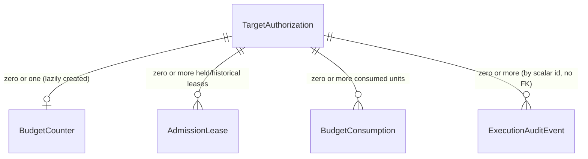

# Phase 1 Data Model: Foundation Spec 07 — Safety / Kill Switch / Budget Enforcement / Execution Audit Trail

Unlike the parent spec's `data-model.md` (illustrative, deferred to foundation child specs for
finalization), this is the real, intended schema — a future `/speckit-implement` pass transcribes this
document, not redesigns it. No migration is run by this planning pass.

**Zero `@relation` edges into F01's or the core schema's existing models (research.md R9).** Every
cross-entity reference below (`targetAuthorizationId`, `targetId`, `scanId`, `executionId`) is a plain
scalar string column with an index, never a Prisma `@relation` field — the identical pattern
`AuditLogEntry.actorId` already uses in this schema ("intentionally unconstrained, not a relation field").
This means **this spec requires zero structural changes to `Target`, `TargetAuthorization`,
`ScopeDefinition`, `Scan`, or `CapabilityExecution`** — a stronger non-modification guarantee than F01
itself achieved for `Target` (F01 needed two Prisma-required back-relation fields; this spec needs none),
because every one of this spec's own entities is looked up by application code that re-derives tenant
ownership through its stored `userId`/scalar ids, never through a Prisma-traversed relation graph.

## BudgetCounter (new model)

```prisma
model BudgetCounter {
  id                   String   @id @default(cuid())
  targetAuthorizationId String  @unique // one counter per grant; scalar, not a Prisma relation (R9)
  userId               String   // denormalized from the grant's own userId, for tenant-scoped lookup
  consumedRequests     Int      @default(0)
  activeConcurrency    Int      @default(0) // fast-read mirror of current AdmissionLease count; see note below
  createdAt            DateTime @default(now())
  updatedAt            DateTime @updatedAt

  @@index([targetAuthorizationId])
  @@index([userId])
}
```

`activeConcurrency` is a denormalized counter maintained transactionally alongside each `AdmissionLease`
insert/release (incremented on lease acquisition, decremented on release/reclamation, always inside the
same transaction as the lease row's own write) — a fast O(1) read for Safety Admission's concurrency check,
rather than a `COUNT(*)` over live `AdmissionLease` rows on every admission call. It is a cache of a value
this spec's own `AdmissionLease` table can always recompute, never an independent source of truth (the same
discipline F01's `research.md` R4 already applies to `reconfirmControl`'s own cached-vs-live-truth pattern):
a periodic reconciliation sweep (`plan.md`'s maintenance-queue extension) recomputes it from live
`AdmissionLease` rows and corrects drift, closing any gap a crash mid-transaction could otherwise leave.

## AdmissionLease (new model)

```prisma
model AdmissionLease {
  id                    String    @id @default(cuid())
  targetAuthorizationId String    // scalar, not a Prisma relation (R9)
  userId                String    // denormalized, tenant-scoped lookup
  executionId           String    // the execution unit holding this lease
  idempotencyKey        String    // caller-supplied; identifies the attempt (FR-008)
  holderToken           String    // fresh opaque value per acquisition; identifies the current live holder (FR-006a)

  acquiredAt  DateTime  @default(now())
  expiresAt   DateTime  // acquiredAt + 30s (research.md R3); renewed by extending this on each checkpoint
  releasedAt  DateTime?
  reclaimedAt DateTime? // set by the expiry-sweep when a lease is reclaimed rather than explicitly released

  @@unique([targetAuthorizationId, idempotencyKey]) // FR-008: duplicate acquire with same key is a no-op
  @@index([targetAuthorizationId])
  @@index([expiresAt]) // the expiry-sweep's own query shape, mirroring timeout.ts's cutoff-indexed scan
  @@index([executionId])
}
```

A lease is "held" iff `releasedAt IS NULL AND reclaimedAt IS NULL AND expiresAt > now()`. Renewal is an
`UPDATE ... SET expiresAt = now() + 30s WHERE id = ... AND holderToken = $presentedToken AND releasedAt IS
NULL AND reclaimedAt IS NULL` (a guarded conditional update, the same optimistic-CAS shape
`state-machine.ts`'s `transition()` already uses) — a renewal attempted after reclamation, **or presenting
a stale `holderToken`**, is a no-op that returns zero affected rows, never resurrecting a reclaimed lease
(FR-015) and never letting a superseded holder mistake a failed renewal for success. Per FR-006a, the
caller observing that zero-row result MUST treat it as an immediate stop signal for its own execution
unit, not merely a retryable error.

**Why a second token distinct from `idempotencyKey`** (found during this spec's own independent
adversarial review): `idempotencyKey` identifies *the logical attempt* and is deliberately stable across a
redelivery of the same attempt (FR-008) — a redelivered job reusing the same key is supposed to get back
the same `leaseId`. But that same stability is exactly what would let a live-but-superseded original
worker and a newly-dispatched worker both believe they hold the identical lease, with neither able to tell
from the lease id alone that the other now exists. `holderToken` is deliberately the opposite: fresh on
every actual acquisition (including a redelivery that re-acquires after reclamation), so renewal — the one
operation a holder performs repeatedly while actually still working — is the mechanism that detects
supersession, without weakening `idempotencyKey`'s own, separate guarantee.

## BudgetConsumption (new model)

```prisma
model BudgetConsumption {
  id                    String   @id @default(cuid())
  targetAuthorizationId String   // scalar, not a Prisma relation (R9)
  userId                String
  executionId           String
  idempotencyKey        String   // caller-supplied; one request-budget unit per unique key
  consumedAt            DateTime @default(now())

  @@unique([targetAuthorizationId, idempotencyKey]) // FR-008
  @@index([targetAuthorizationId])
  @@index([executionId])
}
```

Each row represents exactly one consumed request-budget unit. `BudgetCounter.consumedRequests` is
incremented by exactly one, in the same transaction as this row's insert, guarded by the unique constraint
above — a retried consumption attempt with the same `idempotencyKey` hits the constraint, the transaction
observes the conflict, and the caller is returned the prior outcome rather than incrementing a second time.

## KillSwitchState (new model)

```prisma
enum SafetyScope {
  EXECUTION
  SCAN
  GRANT
  TARGET
  TENANT
  PLATFORM
}

enum StopLifecycleState {
  REQUESTED
  ACKNOWLEDGED
  STOPPED
}

model KillSwitchState {
  id        String      @id @default(cuid())
  scope     SafetyScope
  scopeId   String      // executionId | scanId | targetAuthorizationId | targetId | userId | "platform"

  state       StopLifecycleState
  triggeredBy String             // userId, operator's userId, or "SYSTEM"
  reason      KillSwitchReason   // see enum below

  requestedAt    DateTime  @default(now())
  acknowledgedAt DateTime?
  stoppedAt      DateTime?
  escalatedAt    DateTime? // set independently of the state enum — see note below

  @@unique([scope, scopeId]) // one current stop record per scope key; see note on re-trigger below
  @@index([scope, scopeId])
}

enum KillSwitchReason {
  USER_CANCELLATION
  AUTHORIZATION_REVOKED
  ENVIRONMENT_RECLASSIFIED
  OPERATOR_EMERGENCY_STOP
  SYSTEM_SAFETY_POLICY
}
```

**`BUDGET_EXHAUSTED` deliberately removed from this enum (found during this spec's own closure/freeze
pass)**: an earlier draft included it, but nothing in this spec's design ever triggers a kill-switch stop
for budget exhaustion — exhausting a grant's request/concurrency budget blocks *new* admission (FR-002)
only, exactly as duration-budget expiry does (FR-016a); neither needs to forcibly stop work that already
holds a valid reservation. Keeping an enum value no code path ever sets is dead weight that misleadingly
suggests a mechanism this spec does not actually have, the same category of issue F01's own closure pass
found and removed its own dead `TargetAuthorizationState` enum for. `ExecutionAuditEventType.BUDGET_EXHAUSTED`
(below) is a different, legitimately-used enum in a different context — it records a Safety Admission
*refusal* event, not a kill-switch trigger reason, and is unaffected by this removal.

`escalatedAt` is independent of `state` (not a fourth enum value) because escalation is an *event that
occurs while still working toward `STOPPED`*, not a replacement terminal state — `state` still ultimately
resolves to `STOPPED` once the escalated (forced) termination completes; `escalatedAt` records that the
cooperative path (FR-013) was exceeded and FR-014's escalation path engaged, for audit purposes (every
transition, including escalation, also writes its own `ExecutionAuditEvent`, FR-022). A `@@unique([scope,
scopeId])` current-state row means a second trigger against an already-`REQUESTED`/`ACKNOWLEDGED` scope key
is an idempotent no-op against the existing row (never a second competing stop record for the same key) —
satisfying the Edge Cases' "stop requested twice"/"release duplicated" requirement structurally, the same
way F01's `revokeAuthorization` treats re-revoking an already-terminal grant as a no-op, not an error.

**Fast-read checkpoint query** (FR-018): a checkpoint for execution unit `E` (belonging to scan `S`, under
grant `G`, against target `T`, owned by user `U`) queries `KillSwitchState` for
`(EXECUTION, E) OR (SCAN, S) OR (GRANT, G) OR (TARGET, T) OR (TENANT, U) OR (PLATFORM, "platform")` — a
single indexed `IN`-style query across at most six rows, well within the 5-second budget FR-013 fixes.

## ExecutionAuditEvent (new model)

```prisma
enum ExecutionAuditEventType {
  ADMISSION_GRANTED
  ADMISSION_REFUSED
  BUDGET_RESERVED
  BUDGET_CONSUMED
  BUDGET_RELEASED
  BUDGET_EXHAUSTED
  STOP_REQUESTED
  STOP_ACKNOWLEDGED
  STOPPED
  ESCALATED
  EXECUTION_COMPLETED // added during this spec's own independent adversarial review: User Story 3's own
                       // reviewer-question list names "completed normally" as an outcome a reviewer must
                       // be able to find — the original 11-value enum had every abnormal/refused/stopped
                       // outcome but no normal-completion event, an omission found by checking the taxonomy
                       // against the spec's own acceptance criteria rather than only against its own events
  SAFETY_VIOLATION
}

model ExecutionAuditEvent {
  id                    String                  @id @default(cuid())
  eventType             ExecutionAuditEventType
  actorId               String                  // userId or "SYSTEM"; intentionally unconstrained,
                                                  // not a relation — same reasoning as AuditLogEntry.actorId
  targetId              String?
  targetAuthorizationId String?
  scopeId               String?                 // F01 ScopeDefinition id, if applicable to this event
  environmentAtEvent    String?                 // TargetEnvironmentClassification value in effect, if any
  scanId                String?
  executionId           String?                 // nullable: an admission-refused event may precede
                                                  // any execution unit ever being created (FR-023)
  executionClass        String?                 // F01 ExecutionClass value, if applicable

  outcome   String   // short, bounded outcome string (e.g. a refusal reason, matching F01's AuthzResult
                      // reason vocabulary where the event is admission-related)
  payload   Json?    // redacted (FR-024) before write — never raw request/response content
  timestamp DateTime @default(now())

  @@index([targetAuthorizationId, timestamp])
  @@index([executionId])
  @@index([targetId, timestamp])
  @@index([actorId, timestamp])
}
```

Distinct from the existing `AuditLogEntry` (admin/control-plane actions — `plan.create`,
`control.demoted`, etc., confirmed by this session's audit to have no `scanId`/execution linkage and never
written for scan/credit/capability-execution events) exactly as `specs/006-scan-architecture-v2/
data-model.md`'s own "Safety" context sketch already distinguishes the two. `ExecutionAuditEvent` records
what a *scan execution* did *against a third-party target*; `AuditLogEntry` continues to record what an
*operator or user* did to *Fahes's own admin-plane state* — the two are never merged into one table.

**Redaction (FR-024)**: `payload` MUST be passed through `@webaudit/redaction` before this row's
`$transaction` commits — enforced at the service layer (the `audit.ts` writer named in `plan.md`'s Project
Structure), never optional, never bypassable by a caller that forgets. **Retention (FR-024, Clarifications
2026-10-07)**: `ExecutionAuditEvent` rows follow the same retention policy/timing as today's report data —
no separate, longer tier — reusing whatever sweep mechanism a future Evidence/Findings spec (F03) or the
existing report-retention sweep already applies, rather than this spec inventing a second one.

## Relationship summary



Every edge above is a **scalar id reference, not a Prisma relation** (research.md R9) — this diagram
describes the conceptual ownership, not a declared foreign key. `TargetAuthorization` itself (F01, frozen)
is read but never written or structurally modified by this spec.

## Validation rules (enforced at the service layer)

- A `BudgetCounter` row is created lazily, exactly once per `targetAuthorizationId`, on that grant's first
  Safety Admission call — never pre-created at grant-creation time (F01's own `createAuthorization`
  contract is not modified to pre-create one; this spec's own admission service owns this, matching the
  general pattern of keeping F01's contract unmodified).
- `BudgetCounter.consumedRequests` MUST NOT exceed the owning grant's `requestBudget` (F01) — checked
  under the same row's `FOR UPDATE` lock that increments it, inside the same transaction as the
  corresponding `BudgetConsumption` insert.
- `BudgetCounter.activeConcurrency` MUST NOT exceed the owning grant's `concurrencyBudget` (F01) — checked
  identically, inside the same transaction as the corresponding `AdmissionLease` insert.
- An `AdmissionLease`'s `expiresAt` MUST NOT be extended (renewed) once `releasedAt` or `reclaimedAt` is
  set — enforced by the guarded conditional `UPDATE ... WHERE releasedAt IS NULL AND reclaimedAt IS NULL`
  renewal statement itself (structural, not a separate check).
- A `KillSwitchState` row's `state` MUST only move `REQUESTED → ACKNOWLEDGED → STOPPED`, matching
  `state-machine.ts`'s own single-source-of-truth transition-table precedent — this spec's own future
  implementation defines an equivalent `ALLOWED` table rather than a ad hoc set of conditionals.
- Every `ExecutionAuditEvent.payload` MUST be redacted before the row's transaction commits (FR-024) — no
  code path may construct this row outside the shared `audit.ts` writer that performs this pass.
- Every new entity's tenant scope is enforced by carrying (directly, for `BudgetCounter`/`AdmissionLease`/
  `BudgetConsumption`) or re-deriving (for `ExecutionAuditEvent`, via its `targetAuthorizationId`/`targetId`)
  the owning grant's `userId` — no lookup path exposes a bare `findUnique({ where: { id } })` result to a
  caller without also checking that caller's `userId`, the identical discipline F01's FR-019/FR-020 already
  establish.

## Schema invariant ownership

| Invariant | Enforced by | Owning spec |
|---|---|---|
| `consumedRequests`/`activeConcurrency` never exceed grant ceilings | SERVICE (`admission.ts`, under `FOR UPDATE`) | F07 (this spec); ceilings themselves are F01's |
| Concurrent admission calls never both consume the last unit | DATABASE (row lock) + SERVICE | F07 |
| Idempotent reservation/consumption/release under retry/redelivery | DATABASE (`@@unique` on idempotency key) + SERVICE | F07 |
| `AdmissionLease` reclaimed within 30s of last renewal | SERVICE (maintenance-queue sweep, modeled on `sweepTimedOutScans`) | F07 |
| `KillSwitchState` transitions follow `REQUESTED→ACKNOWLEDGED→STOPPED` only | SERVICE (transition-table pattern) | F07 |
| Stopped work never resurrects (FR-015) | SERVICE (checkpoint re-checks `KillSwitchState` before any action, including on redelivery) | F07 |
| `ExecutionAuditEvent.payload` redacted before persistence | SERVICE (`audit.ts` writer, no bypass path) | F07 |
| `isAuthorized` itself (scope/environment/revocation/expiry logic) | F01 (unchanged, called fresh by this spec's admission service) | F01 |
| Platform-wide budget ceilings (`requestBudget`/`concurrencyBudget`/`durationBudget` maxima) | F01 (unchanged) | F01 |
| Tenant isolation on every lookup (`userId` re-derivation, no bare relation traversal) | SERVICE | F07 |
| Zero `@relation` edges into `TargetAuthorization`/`Target`/`Scan` (no structural amendment needed) | STRUCTURAL (schema design itself, research.md R9) | F07 |
