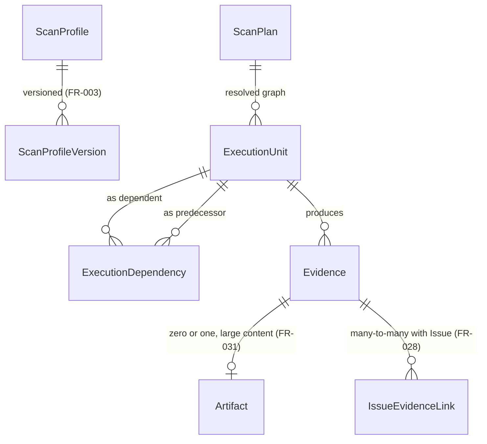

# Phase 1 Data Model: Core Scan & Execution Platform (F02 + F03 + F04 consolidated)

Unlike 006's own `data-model.md` (explicitly illustrative, deferred to the owning foundation spec
for finalization), this is the real, intended schema — matching F01's and F07's own posture, not
006's. No migration is run by this planning pass.

**Zero `@relation` edges into any existing/frozen model** (`research.md` R2, generalizing F07's own
R9 one level further than F07 itself needed). Every reference to `Target`, `Scan`, `Issue`,
`TargetAuthorization`, `CapabilityExecution`, or `User` from any model below is a plain scalar
string column with an index, never a Prisma `@relation` field — this spec requires **zero**
structural changes to any of those five models. Relations declared *between this spec's own eight
new models* are ordinary Prisma relations (both sides are new, so no frozen model is touched
either way).

**Prisma enum-naming note**: F01's own `data-model.md` defines an `ExecutionClass` enum
(`BROWSER | CRAWLER | SOURCE_EXECUTION | ACTIVE_SECURITY | AUTHENTICATED_WORKFLOW |
LOAD_CAPACITY`) as *its own* intended future schema — not yet present in the real
`apps/api/prisma/schema.prisma` (confirmed by direct grep: no `enum ExecutionClass` exists today).
This spec needs a superset (F01's six values plus `PASSIVE_HTTP`/`SOURCE_STATIC`, which never
require `TargetAuthorization` and so are rightly absent from F01's own, narrower enum) and
therefore defines its **own**, distinctly-named `ExecutionUnitClass` enum below rather than
silently assuming it may widen F01's enum — widening a frozen sibling spec's own enum without a
documented amendment is exactly the kind of casual reopening the triggering master prompt forbids.
When both specs are eventually implemented in the same `schema.prisma`, `ExecutionUnitClass`'s six
non-passive values and `ExecutionClass`'s six values are value-for-value identical by design (not
by coincidence) — a future implementer keeps them in lockstep by convention, not by a shared Prisma
type (Prisma has no enum-subtyping mechanism to express this directly).

## New enums

```prisma
enum ExecutionUnitClass {
  PASSIVE_HTTP           // never requires TargetAuthorization — today's existing baseline
  SOURCE_STATIC           // never requires TargetAuthorization — today's existing baseline
  BROWSER
  CRAWLER
  SOURCE_EXECUTION
  ACTIVE_SECURITY
  AUTHENTICATED_WORKFLOW
  LOAD_CAPACITY
  TELEMETRY               // degenerate case — see note below
}
```

**`TELEMETRY` is a degenerate `ExecutionUnit`** (per 006's own Execution-Class Matrix: "N/A (no
execution to cancel... re-ingest, not re-test)"). A `TELEMETRY`-class unit's `requiresSafety
Checkpoint` is always `false` (FR-012) and it never reaches `DISPATCHED` onto any of this spec's
new per-class queues — it exists in this enum only so FR-004's three-layer domain-to-class mapping
stays total (every domain resolves to *some* class), not because this spec designs an ingestion
engine (E17 owns that, unbuilt).

```prisma
enum ExecutionUnitStatus {
  PLANNED     // exists in the resolved graph, not yet eligible
  SKIPPED     // own precondition false at resolution time — never reached PLANNED as dispatchable
  BLOCKED     // a dependency failed/was cancelled before this unit could dispatch (FR-010)
  ADMITTED    // passed F07 safetyCheckpoint (or N/A for passive classes), about to dispatch
  REFUSED     // never admitted — authorization/scope/budget/safety refusal (FR-022)
  DISPATCHED  // a queue job exists for it
  RUNNING
  COMPLETED
  FAILED      // FailureClass-classified (below)
  CANCELLED   // user-initiated (F07 USER_CANCELLATION)
  KILLED      // operator/kill-switch/safety-policy (F07's other KillSwitchReason values)
}

enum FailureClass {
  TRANSIENT_INFRASTRUCTURE
  DETERMINISTIC_FINDING          // never actually persisted as ExecutionUnit.failureClass — this
                                  // value exists only so the classification function (research.md
                                  // R9/R9a) has an explicit bucket for "this is not a failure, it
                                  // is a measured result" and routes it to status = COMPLETED
                                  // instead; a row with status = FAILED never has this value.
  TARGET_UNAVAILABLE
  SAFETY_REFUSED
  TIMEOUT
  ENGINE_DEFECT
  INVALID_CONFIGURATION
  CUSTOMER_CODE_FAILURE
  EXTERNAL_DEPENDENCY_FAILURE
}

enum EvidenceKind {
  HTTP_TRANSACTION
  SOURCE_LOCATION
  SCREENSHOT
  SCREENSHOT_DIFF
  DOM_NODE
  ACCESSIBILITY_NODE
  BROWSER_TRACE
  HAR
  VIDEO
  LOAD_METRICS
  SECURITY_REPRODUCTION
  CODE_FLOW
  DEPENDENCY
  TELEMETRY
}

enum ScanPlanKind {
  INITIAL
  REVERIFY
}

enum ScanPlanState {
  RESOLVED
  REFUSED
}
```

## ScanProfile (new model)

```prisma
model ScanProfile {
  id              String   @id @default(cuid())
  slug            String   @unique // placeholder names only, FR-002 — not invented here
  isSystemDefined Boolean  @default(true)
  createdBy       String?  // userId; scalar, no relation — null for system-defined profiles
  createdAt       DateTime @default(now())
  updatedAt       DateTime @updatedAt

  versions ScanProfileVersion[]

  @@index([slug])
}
```

## ScanProfileVersion (new model)

```prisma
model ScanProfileVersion {
  id                     String   @id @default(cuid())
  scanProfileId          String
  version                Int      // monotonic per profile, starts at 1
  defaultDomains         ModuleType[]   // existing Prisma enum (schema.prisma:28), reused unchanged
  domainExecutionClasses Json     // { [ModuleType]: ExecutionUnitClass[] } — FR-004's mapping
  advancedConfigSchema   Json?    // JSON-schema-shaped; validated at resolution time, never executed
  createdAt              DateTime @default(now())

  scanProfile ScanProfile @relation(fields: [scanProfileId], references: [id], onDelete: Cascade)

  @@unique([scanProfileId, version])
  @@index([scanProfileId])
}
```

`defaultDomains ModuleType[]` reuses the **existing** `ModuleType` Prisma enum
(`apps/api/prisma/schema.prisma:28`) directly — referencing an existing enum from a new model adds
no relation and requires no back-relation field, unlike referencing an existing *model*; this is
not a structural change to anything `ModuleType` already belongs to.

## ScanPlan (new model, generalizes `Scan.capabilitySnapshot`'s intent)

```prisma
model ScanPlan {
  id                   String        @id @default(cuid())
  kind                 ScanPlanKind  @default(INITIAL)
  userId               String        // denormalized tenant owner (FR-041); scalar, no relation
  scanId               String?       // required when kind = INITIAL; scalar, no relation into Scan
  reverifyIssueId      String?       // required when kind = REVERIFY; scalar, no relation into Issue
  scanProfileVersionId String?       // null for a fully custom (non-profile) configuration
  state                ScanPlanState
  refusalReason        String?       // populated only when state = REFUSED (FR-007's F01 reason, or this spec's own graph-validation refusal)
  resolvedAt           DateTime      @default(now())

  executionUnits ExecutionUnit[]

  @@index([scanId])
  @@index([reverifyIssueId])
  @@index([userId])
}
```

`scanId`/`reverifyIssueId` are mutually exclusive by `kind` (service-layer validation, not a bare
Prisma `CHECK`, matching F01's own stated precedent of not adding Postgres-level `CHECK`
constraints for cross-field invariants). A `REVERIFY`-kind plan's tenant ownership (`userId`) is
derived from the reverified `Issue`'s own owning `Scan.userId` at creation — re-derived, never
caller-supplied, the identical discipline F01's `TargetAuthorization.userId` already applies to
itself.

## ExecutionUnit (new model — NOT an extension of `CapabilityExecution`; see `spec.md` Clarifications)

```prisma
model ExecutionUnit {
  id                       String              @id @default(cuid())
  scanPlanId               String
  userId                   String              // denormalized tenant owner (FR-041); scalar, no relation
  targetId                 String              // scalar, no relation into Target
  targetAuthorizationId    String?             // scalar, no relation into TargetAuthorization; null for PASSIVE_HTTP/SOURCE_STATIC/TELEMETRY
  executionUnitClass       ExecutionUnitClass
  engineId                 String              // opaque, stable string key a future engine spec declares (e.g. "active-security.sqli-probe")
  configuration            Json                // per-caller configuration (spec.md FR-012; this spec's own Edge Cases)
  priority                 Int                 // reuses existing plan-tier priority-band model, extended
  timeoutPolicyMs          Int
  retryPolicy              Json                // { maxAttempts: number, eligibleFailureClasses: FailureClass[] } — FR-023/FR-024
  requiresSafetyCheckpoint Boolean             @default(false)
  idempotencyKey           String              // FR-025; derived deterministically from (this unit's id, attempt) by the owning worker, never caller-invented per call
  status                   ExecutionUnitStatus @default(PLANNED) // TELEMETRY-class units are the one
                                                                   // named exception to the full
                                                                   // PLANNED->ADMITTED->DISPATCHED->
                                                                   // RUNNING transition chain below —
                                                                   // they transition directly
                                                                   // PLANNED -> COMPLETED at
                                                                   // generation time (no dispatch, no
                                                                   // checkpoint, since there is no
                                                                   // execution to run), found during
                                                                   // this spec's own checklist review
  attempt                  Int                 @default(1)
  blockedByExecutionUnitId String?             // FR-010; scalar — the specific predecessor that caused BLOCKED
  skippedReason            String?             // populated only when status = SKIPPED
  failureClass             FailureClass?       // populated only when status = FAILED (research.md R9)
  evidenceContractRef      String?             // which Evidence.kind values this unit is expected to produce
  credentialBindingRef     String?             // FR-020/FR-045; opaque, no raw secret ever stored here
  costMicros               Int                 @default(0) // FR-044, extends CapabilityExecution.costMicros's pattern
  progressSnapshot         Json?               // FR-027; bounded size, throttled writes, last-write-wins
  progressIndeterminate    Boolean             @default(false)
  createdAt                DateTime            @default(now())
  dispatchedAt             DateTime?
  startedAt                DateTime?
  completedAt              DateTime?

  scanPlan     ScanPlan              @relation(fields: [scanPlanId], references: [id], onDelete: Cascade)
  dependents   ExecutionDependency[] @relation("DependentUnit")
  dependencies ExecutionDependency[] @relation("DependsOnUnit")
  evidence     Evidence[]

  @@unique([scanPlanId, idempotencyKey])
  @@index([scanPlanId])
  @@index([userId])
  @@index([targetAuthorizationId])
  @@index([status])
  @@index([blockedByExecutionUnitId])
}
```

## ExecutionDependency (new model — DAG edge)

```prisma
model ExecutionDependency {
  id                        String @id @default(cuid())
  executionUnitId           String // the dependent unit
  dependsOnExecutionUnitId  String // the predecessor

  executionUnit  ExecutionUnit @relation("DependentUnit", fields: [executionUnitId], references: [id], onDelete: Cascade)
  dependsOnUnit  ExecutionUnit @relation("DependsOnUnit", fields: [dependsOnExecutionUnitId], references: [id], onDelete: Cascade)

  @@unique([executionUnitId, dependsOnExecutionUnitId])
  @@index([dependsOnExecutionUnitId])
}
```

Acyclicity (spec.md FR-013) is enforced at **resolution time** by the Plan Resolver (a graph-
algorithm check on the in-memory graph before any row is written), not by a Postgres constraint —
the same "service-enforced, not DB-`CHECK`-enforced" posture F01's own schema already adopts for
its cross-field invariants.

## Evidence (new model — typed envelope; many-to-many with `Issue`, correcting 006's 1:1 sketch)

```prisma
model Evidence {
  id              String       @id @default(cuid())
  executionUnitId String
  kind            EvidenceKind
  inlinePayload   Json?        // small, structured evidence; redacted before write if required (FR-030)
  artifactId      String?      // null unless this evidence's content was large enough to externalize (FR-031)
  redacted        Boolean      @default(false) // true iff this row passed through @webaudit/redaction (FR-030)
  createdAt       DateTime     @default(now())

  executionUnit ExecutionUnit       @relation(fields: [executionUnitId], references: [id], onDelete: Cascade)
  artifact      Artifact?           @relation(fields: [artifactId], references: [id])
  issueLinks    IssueEvidenceLink[]

  @@index([executionUnitId])
  @@index([artifactId])
}
```

## IssueEvidenceLink (new model — the many-to-many join `spec.md` FR-028 requires)

```prisma
model IssueEvidenceLink {
  id         String @id @default(cuid())
  issueId    String // scalar, no relation into Issue (existing/frozen)
  evidenceId String

  evidence Evidence @relation(fields: [evidenceId], references: [id], onDelete: Cascade)

  @@unique([issueId, evidenceId])
  @@index([issueId])
  @@index([evidenceId])
}
```

A Finding (`Issue`, unchanged) that cites `n` pieces of supporting evidence has `n` rows here; a
piece of `Evidence` supporting `m` Findings has `m` rows here — both directions of the many-to-many
relationship master-prompt §20 requires ("the same evidence may support multiple findings... a
finding may depend on multiple evidence records") are satisfied by this one join table, with no
denormalized array field on either side to keep in sync.

## Artifact (new model — large binary evidence reference, R2-backed)

```prisma
model Artifact {
  id                 String   @id @default(cuid())
  scanId             String   // scalar, no relation into Scan
  userId             String   // denormalized tenant owner (FR-041); scalar, no relation
  executionUnitId    String   // scalar — not a Prisma relation even though ExecutionUnit is also new (see note)
  storageKey         String   @unique // artifacts/<scanId>/<executionUnitId>/<sha256-or-cuid>, research.md R8
  contentType        String
  sizeBytes          Int
  retentionPolicyRef String   @default("report-retention-parity") // FR-034
  createdAt          DateTime @default(now())

  evidence Evidence[]

  @@index([scanId])
  @@index([userId])
  @@index([executionUnitId])
}
```

**Why `Artifact.executionUnitId` is a plain scalar rather than a declared `@relation`, even though
both models are this spec's own**: `research.md` R8 requires the R2 upload to happen *before* the
`Artifact` row is inserted (so a row never references a nonexistent object), which means the row
insert itself must be able to succeed independent of whether its own `ExecutionUnit` row is in any
particular state at that exact instant (e.g. mid-finalization in a separate concurrent
transaction). A scalar id avoids any Prisma-enforced ordering/locking coupling between the two
inserts beyond what the service layer already serializes explicitly — the identical reasoning F07
applied to its own `AdmissionLease.targetAuthorizationId` (also scalar, despite both being
F07's own models).

## Relationship summary



No edge exists, anywhere in this schema, from any new model to `Target`/`Scan`/`Issue`/
`TargetAuthorization`/`CapabilityExecution`/`User` — every one of those six existing/frozen models
requires **zero** structural change for this spec's package to be implementable.

## Validation rules (enforced at the service layer)

- `ScanPlan.scanId` MUST be non-null iff `kind = INITIAL`; `ScanPlan.reverifyIssueId` MUST be
  non-null iff `kind = REVERIFY` — mutually exclusive, service-enforced.
- `ScanPlan.userId` MUST be re-derived from the owning `Scan.userId` (for `INITIAL`) or the
  reverified `Issue`'s owning `Scan.userId` (for `REVERIFY`) at creation — never caller-supplied,
  matching F01's `TargetAuthorization.userId` precedent exactly.
- `ExecutionUnit.targetAuthorizationId` MUST be null when `executionUnitClass` is
  `PASSIVE_HTTP`/`SOURCE_STATIC`/`TELEMETRY`, and MUST be non-null (and reference a grant that
  returned `AUTHORIZED` for this unit's specific destination at resolution time, per FR-007) for
  every other value.
- `ExecutionUnit.requiresSafetyCheckpoint` MUST be `true` iff `executionUnitClass` is one of F07's
  own `FR-026`-named classes (`BROWSER`, `CRAWLER`, `SOURCE_EXECUTION`, `ACTIVE_SECURITY`,
  `AUTHENTICATED_WORKFLOW`, `LOAD_CAPACITY`) — computed, never independently caller-set, so it can
  never silently drift from F07's own enum.
- `ExecutionDependency` edges MUST only ever reference two `ExecutionUnit`s sharing the same
  `scanPlanId` (FR-013) — checked at creation, not only by convention.
- The acyclicity check (above) runs once, at plan-resolution time, over the complete graph the
  resolver is about to persist — a cycle refuses the entire plan resolution (`ScanPlanState =
  REFUSED`, `refusalReason: "cyclic dependency graph"`), never a partially-written graph.
- `Evidence.redacted` MUST be `true` before the row's transaction commits whenever its owning
  `ExecutionUnit.executionUnitClass` is `ACTIVE_SECURITY`/`AUTHENTICATED_WORKFLOW`/
  `SOURCE_EXECUTION` (FR-030) — enforced by the one shared Evidence-writer service function
  (`contracts/evidence-envelope-contract.md`), never bypassable by a new call site.
- `Evidence.artifactId` MUST be non-null whenever `inlinePayload`'s serialized size would exceed
  this platform's own fixed inline-size ceiling (FR-031/`research.md` R7) — checked at write time
  by the same shared writer.
- `Artifact.sizeBytes` MUST NOT cause the cumulative sum of a scan's own `Artifact.sizeBytes` to
  exceed the per-scan budget, and MUST NOT itself exceed the per-object budget (FR-033) — checked
  at write time, refusing (never truncating) an over-budget write.
- `IssueEvidenceLink` rows MUST only ever be created by the Finding-materialization service
  function (`contracts/finding-materialization-contract.md`) — never written directly by an
  engine, so provenance (FR-037) is always attributable to a known, auditable code path.

## Schema invariant ownership

| Invariant | Enforced by | Owning context |
|---|---|---|
| `ScanPlan` immutability (graph membership, FR-006/FR-015) | SERVICE (no update-graph operation exists in this spec's own contracts, mirroring F01's `ScopeDefinition` immutability-by-absence-of-mutation-path pattern) | Scan Planning |
| Acyclic, intra-plan-only dependency graph | SERVICE (resolver's own pre-write validation) | Scan Planning |
| `ExecutionUnit.requiresSafetyCheckpoint` matches F07's own class list | SERVICE (computed, never caller-set) | Scan Planning (computed) / Execution Runtime (consumed) |
| Fresh F01/F07 check at every mandatory point (never cached across a boundary) | SERVICE (this spec's own `contracts/execution-runtime-contract.md`, calling F01/F07's own enforcement) | Execution Runtime |
| `ExecutionUnit` finalization idempotency (`idempotencyKey`) | DATABASE (`@@unique`) + SERVICE | Execution Runtime |
| `FailureClass` assignment (never engine-self-reported) | SERVICE (`research.md` R9's classification function) | Execution Runtime |
| Process-level force termination (FR-019) | SERVICE + OS (parent-armed `SIGKILL`, outside Postgres entirely) | Execution Runtime |
| Progress-write rejection after terminal status (FR-027a) | SERVICE (the durable-snapshot writer checks `status` before applying) | Execution Runtime |
| `Evidence.redacted` before persistence for the three named classes | SERVICE (the one shared Evidence writer, no bypass) | Result/Evidence Platform |
| `Artifact` per-object/per-scan size budgets | SERVICE (checked at write time) | Result/Evidence Platform |
| `Artifact` proven deletion call site / orphan reclamation | SERVICE (extended `enforceRetention` + maintenance sweep) | Result/Evidence Platform |
| `IssueEvidenceLink` provenance (only the materialization service writes it) | SERVICE | Result/Evidence Platform |
| Tenant isolation on every lookup (`userId` re-derivation, no bare relation traversal) | SERVICE | All three contexts |
| Zero `@relation` edges into `Target`/`Scan`/`Issue`/`TargetAuthorization`/`CapabilityExecution`/`User` | STRUCTURAL (schema design itself, `research.md` R2) | All three contexts |
