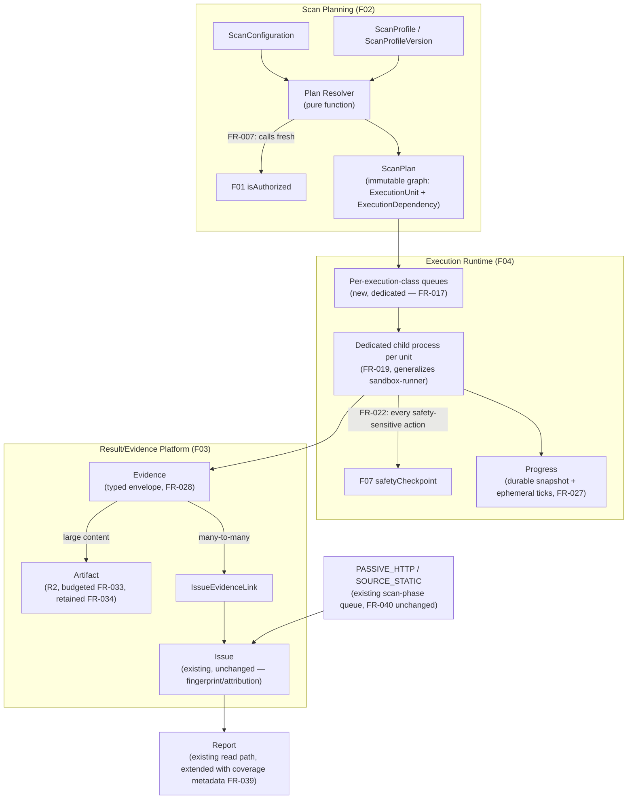
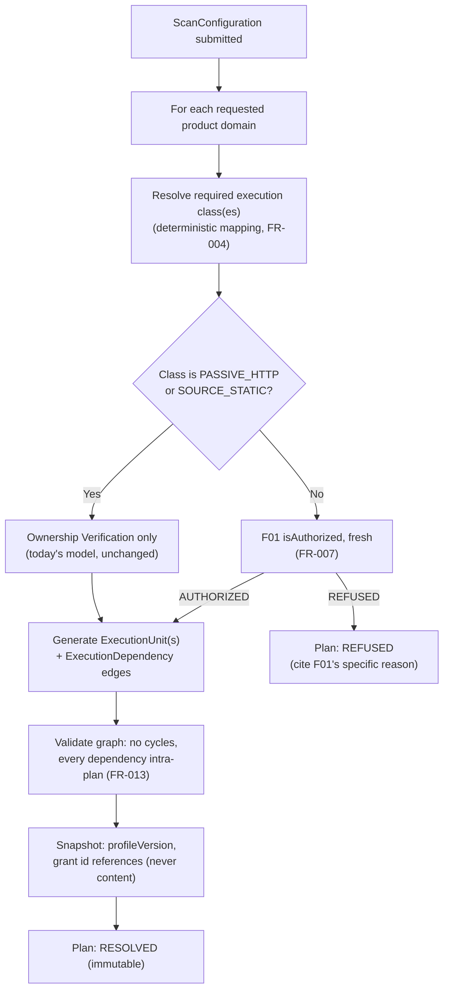
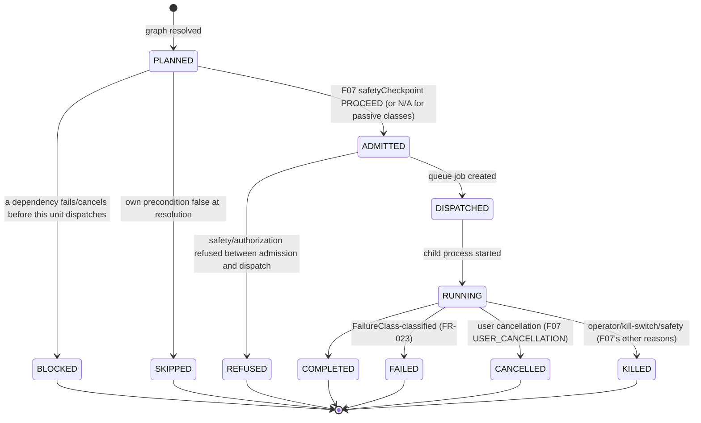
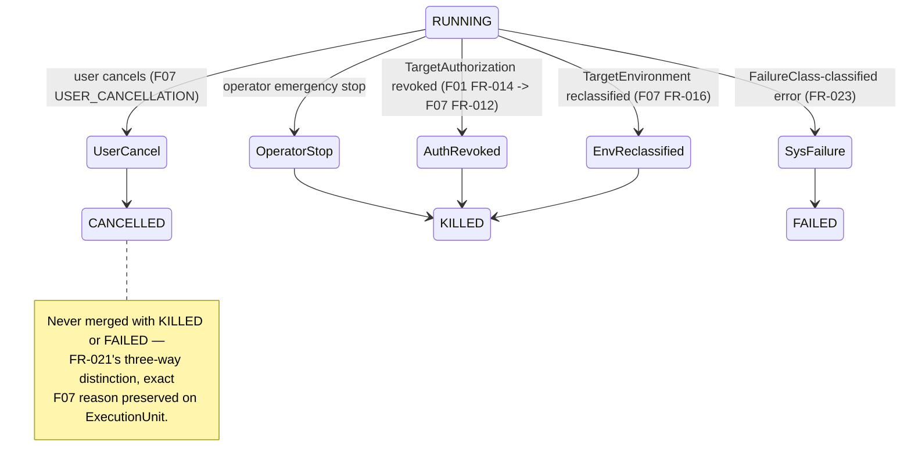
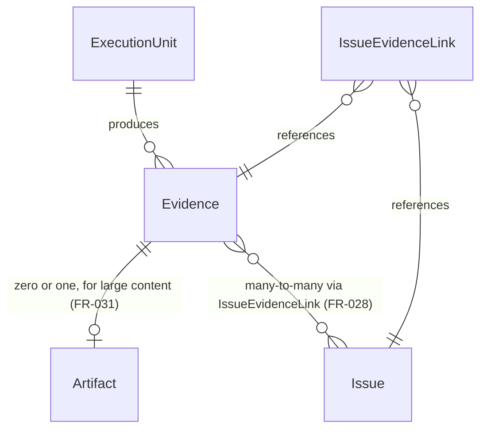
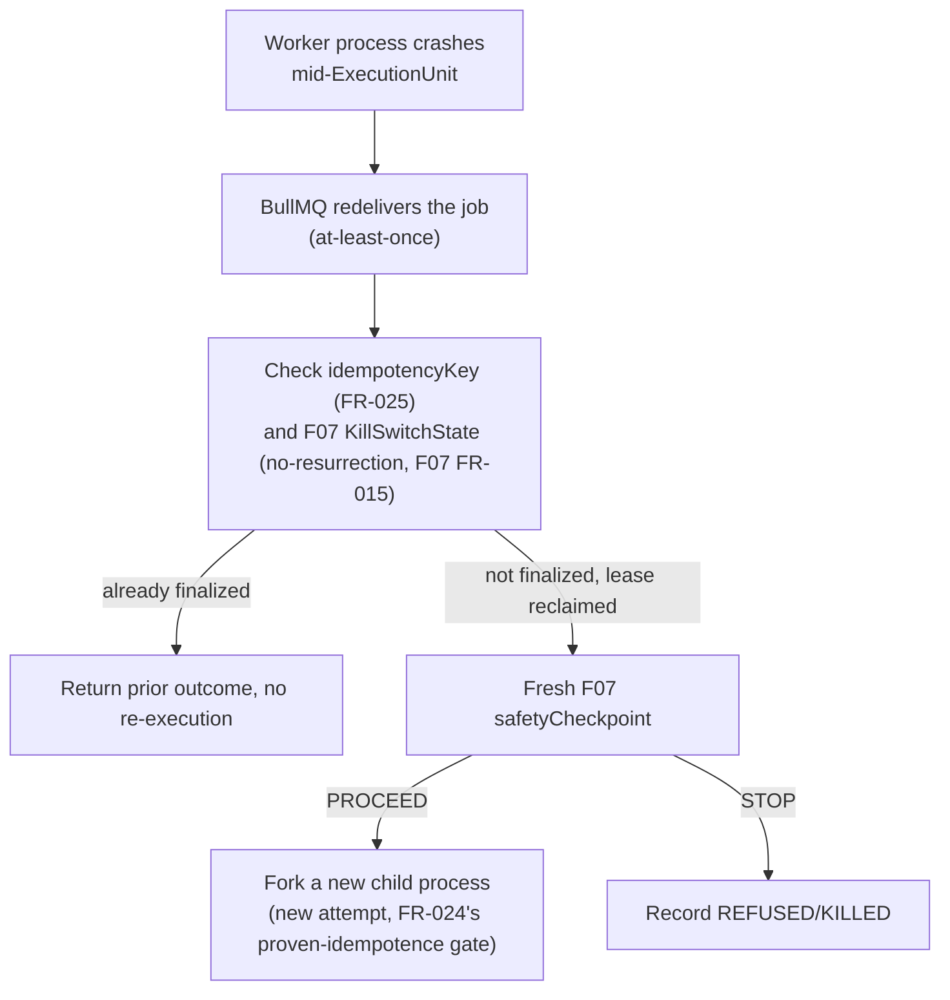
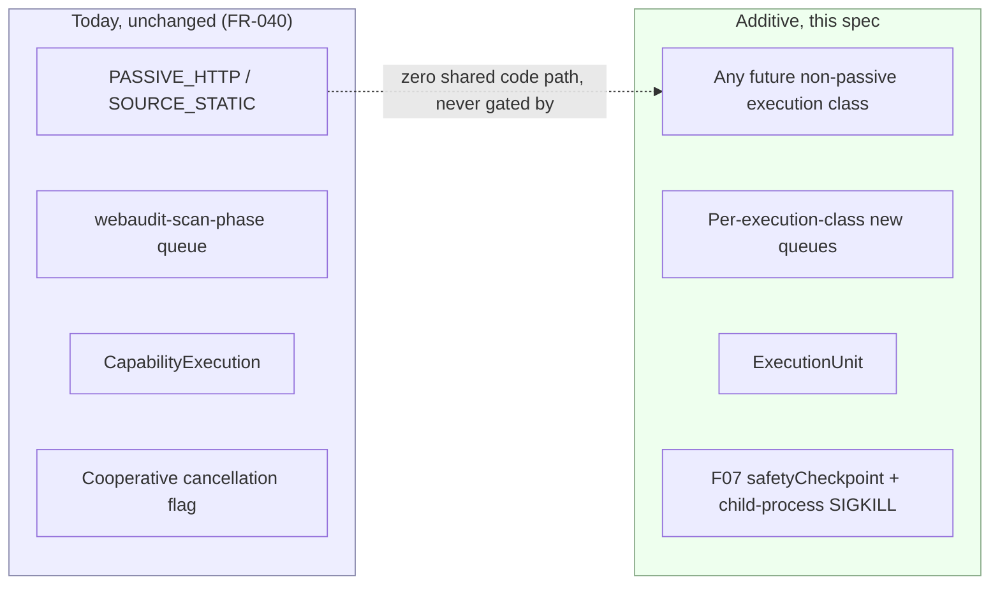

# Implementation Plan: Core Scan & Execution Platform (F02 + F03 + F04 consolidated)

**Branch**: `009-core-scan-execution-platform` | **Date**: 2026-10-07 | **Spec**: [spec.md](./spec.md)

**Input**: Feature specification from `specs/009-core-scan-execution-platform/spec.md`

**Note on template fit**: like F01/F07, this plan does not implement anything — no migration runs,
no application code is written (Constitution Principle XIV's gate; this session's explicit
instruction not to run `/speckit-implement`/`/speckit-converge`). Unlike F01/F07, this plan's scope
spans three bounded contexts at once; its Constitution Check and Reuse/Extend/New Matrix are
correspondingly organized by context so a reviewer can verify each context's own boundary
discipline independently.

## Summary

This spec turns 006's placeholder Scan Profile / Execution Plan / Execution Runtime / Evidence /
Artifact concepts into one coherent, implementable design, organized around three internal bounded
contexts that never collapse into each other: **Scan Planning** (resolves a `ScanConfiguration`
into an immutable `ScanPlan`/`ExecutionGraph`, consuming F01's authorization contract — never
dispatching anything itself), **Execution Runtime** (dispatches `ExecutionUnit`s onto new,
per-execution-class queues, consuming F07's safety-checkpoint contract and providing the process-
isolation/force-termination mechanism F07 explicitly handed to this spec — never deciding what
evidence means), and **Result/Evidence Platform** (typed `Evidence` envelopes, R2-backed
`Artifact`s with proven retention, Finding materialization provenance — never executing anything
or scheduling workers). The single hardest problem this plan resolves explicitly: F07's own
`research.md` R7 named a process-topology requirement and handed it to "F04" by name; this plan
resolves it with a dedicated-child-process-per-long-running-unit pattern directly generalizing the
already-proven `apps/sandbox-runner` SIGKILL mechanism, scoped correctly below Constitution
Principle XI's heavier container/VM-grade bar (which remains E13's own, separate problem for
genuinely untrusted customer code).

## Technical Context

**Language/Version**: Node.js >=22, TypeScript — existing monorepo standard, no new runtime.

**Primary Dependencies**: Prisma/PostgreSQL (existing, system of record for every new durable
entity this spec defines), BullMQ/Redis (existing — this spec defines new *queue instances*
following the existing `packages/config/src/queues.ts` pattern, not a new queueing technology),
Cloudflare R2 (existing, extended for `Artifact` storage), Node's own `child_process` module
(existing runtime primitive, no new dependency — FR-019's process-isolation mechanism). No new
third-party dependency is introduced by this plan.

**Storage**: PostgreSQL via Prisma — seven new tables (`ScanProfile`, `ScanProfileVersion`,
`ScanPlan`, `ExecutionUnit`, `ExecutionDependency`, `Evidence`, `IssueEvidenceLink`, `Artifact` —
eight, not seven; see `data-model.md`), every one referencing `Target`/`Scan`/`Issue`/
`TargetAuthorization`/`CapabilityExecution` by plain scalar id with **zero** `@relation` edges into
any of them (this spec's own Clarifications, generalizing F07's own `research.md` R9 one level
further than F07 itself needed to). R2 extended with a new `artifacts/<scanId>/<executionUnitId>/
<sha256-or-cuid>` key family, distinct from the existing `uploads/<userId>/...`/`scans/<scanId>/...`
prefixes. Redis used only as the existing progress/kill-switch propagation accelerant — never a
system of record for anything this spec defines (constitution's Technology Constraints, unchanged).

**Testing**: existing Vitest stack; a future `/speckit-implement` pass inherits the existing
adverse-test discipline this codebase already applies to credits/control-gate/F07's own named
scenarios (`credits-debit-refund-race.test.ts`, `control-gate.test.ts`) — this plan's own Phase 1
names the adversarial scenarios (see Independent Adversarial Review below) a future implementation
must prove, mirroring F07's own `quickstart.md` Part B pattern.

**Target Platform**: existing `apps/api` (Plan Resolver service, `ScanProfile`/`ScanPlan` read
routes) and `apps/worker` (new per-execution-class queue consumers, the child-process dispatch
wrapper, the Evidence/Artifact writers) — no new deployable unit. A future engine spec (E10-E17)
may introduce its own deployable unit for its own isolation reasons (a real browser-pool service,
a container runtime); this plan introduces none.

**Project Type**: N/A — foundation/platform-contract planning artifact, the same framing as F01/
F07, spanning three bounded contexts rather than one.

**Performance Goals**: N/A as a running-system target. Per master-prompt §30's bound: no execution
class's progress reporting may cost one DB transaction per tick (FR-027's throttled-snapshot
design); no `Evidence`/`Artifact` payload may grow unboundedly in-row (FR-031's artifact-reference
rule); no `ExecutionUnit` query may require loading every artifact into memory (R2 references are
retrieved on demand, never eagerly joined into a plan-wide payload).

**Constraints**: the six constraints this plan treats as binding across every future consumer: (1)
strict parallel-run, zero regression to `PASSIVE_HTTP`/`SOURCE_STATIC` (FR-040); (2) zero
`@relation` edges into any existing/frozen model (FR-040's structural half, this spec's own
Clarifications); (3) every execution class F07's mechanisms apply to MUST call F07's
`safetyCheckpoint` at F07's own mandatory points, never a private equivalent (FR-022); (4) every new
entity MUST be tenant-scoped at creation/read (FR-041); (5) every `Artifact` MUST have a proven
deletion call site before this platform is considered complete (FR-034); (6) no AI judgment may
decide a planning, dispatch, or evidence-sufficiency outcome (FR-046).

**Scale/Scope**: eight new Prisma models, one new enum (`FailureClass`) plus extensions to existing
enums (`ExecutionUnit.status`, a new, larger set than today's `ModuleState`), a new queue-per-
execution-class topology (four to six new queue *names*, zero new queue *technology*), ten
documented contracts (`contracts/`), four checklists. Directly unblocks every Engine spec (E10-E17)
and the six renumbered product-testing specs (SPEC 2-6) per the master prompt's own §39 — this is
now the one remaining prerequisite those fourteen future specs share (together with F01/F07,
already satisfied).

## Constitution Check

*GATE: evaluated against `.specify/memory/constitution.md` v1.2.0 (Principles I-XIV), organized by
this spec's own three bounded contexts so a reviewer can verify each independently.*

| Principle | Scan Planning | Execution Runtime | Result/Evidence Platform |
|---|---|---|---|
| I. Skills Are Plugins | PASS — the Plan Resolver reaches engines only through `engineId`/`capabilityRef` (FR-012), never a hardcoded engine list; adding an engine requires zero Planning-context edits. | PASS — dispatch is driven by `ExecutionUnit.executionClass`/queue-placement metadata, never a core-code engine enum branch. | PASS — `Evidence.kind` is an extensible tag, not a closed switch core code branches on. |
| II. Vendored Forever | PASS — not applicable; no third-party code is fetched by any context this spec defines. | PASS — same. | PASS — same. |
| III. Deterministic Before Probabilistic | PASS — the Plan Resolver (FR-005) is a pure function; FR-046 ("AI Is Not Planning") is this context's own binding rule. | PASS — dispatch/retry/kill decisions are pure functions of durable state (FR-046). | PASS — Finding attribution (`MEASURED`/`AI_JUDGMENT`) remains the runner's exclusive assignment, unchanged by this spec (FR-036). |
| IV. No Single Point of AI Failure | PASS — not applicable; no AI usage introduced. | PASS — same. | PASS — same. |
| V. Untrusted Code Runs Isolated | PASS — not applicable; Planning never executes anything. | PASS — FR-019's process isolation is for *trusted* Fahes engine code (liveness), explicitly distinguished from Principle XI's untrusted-code bar (this spec's own Clarifications); no untrusted code is executed by this spec's own mechanisms. | PASS — not applicable. |
| VI. Metered, Reconciled Cost | PASS — Plan resolution does not charge credits itself (today's existing quote/debit flow, unchanged, FR-040); it only resolves what *would* need to be charged. | PASS — `ExecutionUnit.costMicros` (FR-044) extends the existing metering primitive; actual pricing stays F06's concern, not invented here. | PASS — `Artifact` storage is bounded by FR-033's write-time budget, preventing unmetered storage growth. |
| VII. Verify Narrowly, Rescan Rarely | PASS — FR-029's reverify-resolves-its-own-minimal-plan design directly preserves "never re-run a full module/scan to confirm one issue," generalized to new execution classes. | PASS — same mechanism, Runtime-context half (a reverify's single-unit plan dispatches exactly one unit, not a full graph). | PASS — reverify evidence supersedes/links to the original finding via the same `IssueEvidenceLink` mechanism (FR-037), no special-cased evidence path. |
| VIII. Engines Serve Domains | PASS — FR-004's three-layer distinction (domain -> execution class -> execution unit) is this context's entire charter; a domain never becomes a queue job directly. | PASS — queue placement is per *execution class*, never per *domain*; two domains needing the same engine share one dispatch path (FR-017's per-class, not per-domain, queue model). | PASS — `Evidence`/`Artifact` are shared contracts every engine populates identically (FR-028/FR-032); no domain or engine owns a private evidence shape. |
| IX. Evidence Is Reproducible | PASS — not applicable to Planning directly; the plan it resolves references the fingerprint mechanism's inputs (authorization/scope snapshot) without altering it. | PASS — not applicable directly; Runtime dispatches, it does not compute fingerprints. | PASS — FR-036 explicitly preserves the existing `fingerprintParts` mechanism as the one identity scheme; FR-028's many-to-many correction does not touch attribution or fingerprinting. |
| X. Authorization Is Not Ownership | PASS — FR-007 calls F01's `isAuthorized` fresh at resolution time, never substituting Ownership Verification; FR-015 explicitly never freezes a live authorization verdict inside an immutable plan. | PASS — FR-022/FR-022a call F07's checkpoint (which itself calls F01 fresh) at every mandatory point; this context never caches an authorization result across a safety-sensitive action. | PASS — not applicable directly; Evidence/Artifact carry authorization *provenance* (FR-037) but never re-decide authorization. |
| XI. Untrusted Code Isolation | PASS — not applicable; Planning executes nothing. | PASS — FR-019 is explicitly scoped below this principle's bar per this spec's own Clarifications (a liveness mechanism for trusted code, not a containment boundary for untrusted code); E13 retains sole ownership of the actual Principle XI isolation mechanism. | PASS — not applicable. |
| XII. Long-Running Work | PASS — Planning does not execute, so it has no lifecycle of its own beyond resolution (a bounded, synchronous operation). | PASS — FR-017's per-execution-class dedicated-queue rule and FR-023/FR-024's idempotency-gated retry policy are this context's direct implementation of this principle, generalized from the existing `webaudit-reverify`-own-queue precedent. | PASS — not applicable directly; Evidence/Artifact writes are themselves short, bounded operations regardless of how long the producing execution ran. |
| XIII. Tenant Boundaries | PASS — `ScanPlan`/`ScanProfile` are tenant-scoped through their owning `Scan`/creator, per FR-041. | PASS — `ExecutionUnit` lookup is tenant-scoped at every call site, per FR-026/FR-041. | PASS — `Evidence`/`Artifact`/`IssueEvidenceLink` are tenant-scoped through their owning `Scan`, per FR-041/FR-042; `Artifact`'s R2 key is tenant-scoped and content-addressed where feasible. |
| XIV. Capability Contract | PASS — `contracts/execution-unit-contract.md`/`scan-profile-contract.md`/`execution-plan-contract.md` fully specify what Planning hands to Runtime. | PASS — `contracts/execution-runtime-contract.md`/`progress-event-contract.md` fully specify what Runtime calls and emits. | PASS — `contracts/evidence-envelope-contract.md`/`artifact-contract.md`/`finding-materialization-contract.md` fully specify what this context accepts and guarantees. |

**Gate result: PASS, no violations, across all three contexts.** Complexity Tracking table is
empty — no principle required an exception in this pass.

### Post-design re-check (after Phase 1)

Re-evaluated against the completed `data-model.md`/`contracts/`. The one point worth re-confirming
explicitly, since it is this plan's own closure-pass correction to 006's draft: does making
`ExecutionUnit` a wholly **new** table (rather than extending `CapabilityExecution`, as 006's own
Reuse/Extend/New Matrix proposed) reopen any Principle VIII "don't rewrite a working subsystem
without evidence" risk? **No** — `CapabilityExecution` is not rewritten, touched, or deprecated by
this decision; it continues to record exactly what it records today, for exactly the dispatch path
it already serves (`PASSIVE_HTTP`/`SOURCE_STATIC` vendored-capability calls), unchanged. `
ExecutionUnit` is additive new surface area for execution classes that have no vendored-capability
analog at all — this is not "rewriting a subsystem because of preference," it is "not forcing a new
concept through an existing table's incompatible required-FK shape," which is the evidence-grounded
default Principle VIII itself prefers. Gate result unchanged: **PASS, no violations.**

## Current-State Architecture (condensed — full evidence in `docs/reviews/scan-audit-2026-10-07/`
and this session's own direct reads, cited inline where new)

Four BullMQ queues (`webaudit-scan-phase`/`webaudit-reverify`/`webaudit-maintenance`/
`webaudit-email-notification`, `packages/config/src/queues.ts`), `attempts:1` for scan-phase
(credit/AI-spend safety), `attempts:3` for reverify/email (proven idempotent). 15-minute scan-wide
timeout with a 60-second sweep (`timeout-scheduler.ts`). Cooperative-flag cancellation, never
interrupting in-flight capability work (`orchestrator/cancellation.ts`). `CapabilityExecution`
requires a non-nullable `capabilityId` FK to `Capability` (`schema.prisma:683-707`) — the concrete
fact that makes "extend `CapabilityExecution`" infeasible for a generic cross-engine record (this
plan's own Clarifications finding). `Issue.evidence: Json?` is a single untyped inline field, no
`Artifact`/large-binary-evidence concept exists today. `UploadStorage.remove` exists with zero call
sites (`apps/api/src/services/storage/uploads.ts`) — the proven, open staged-upload retention gap
this plan's own FR-034 closes for the *new* `Artifact` class (the existing ZIP-upload gap itself
remains out of this spec's scope to fix retroactively, since FR-040 forbids modifying today's
intake path — a future, narrowly-scoped fix to `uploads.ts` itself, if pursued, is not gated on this
spec). `apps/sandbox-runner`'s parent-armed, unconditional `SIGKILL` (`limits/timeout.ts`,
`30,000 ms`) is the proven precedent FR-019 generalizes. `AuditLogEntry.actorId`/F07's own
`research.md` R9 are the proven precedent for every new entity's scalar-id-no-relation reference
pattern this plan applies across all eight new tables.

## Target Architecture



### End-to-end scan lifecycle (new classes alongside unchanged passive path)

```mermaid
sequenceDiagram
    participant U as User
    participant API as API
    participant SP as Scan Planning
    participant F01 as F01 (frozen)
    participant ER as Execution Runtime
    participant F07 as F07 (frozen)
    participant REP as Result/Evidence Platform
    U->>API: Create Scan (ScanConfiguration: profile + domains [+ authorization refs])
    API->>SP: resolve(ScanConfiguration)
    SP->>F01: isAuthorized, per non-passive execution class
    F01-->>SP: AUTHORIZED | REFUSED
    SP->>SP: Build ExecutionGraph (PLANNED/SKIPPED/BLOCKED pre-computed where derivable)
    SP-->>API: ScanPlan (RESOLVED | REFUSED)
    API->>ER: Dispatch eligible ExecutionUnits onto per-class queues
    ER->>F07: safetyCheckpoint (dispatch time, and per FR-013 cadence while running)
    F07-->>ER: PROCEED | STOP
    ER->>ER: Fork dedicated child process (FR-019); arm parent-side SIGKILL deadline
    ER->>REP: Evidence (typed) + Artifact (large content) on completion
    REP->>REP: Materialize Findings via IssueEvidenceLink (fingerprint-identified, existing mechanism)
    REP-->>API: Report (existing read path, extended coverage metadata)
```

### Bounded-context boundaries

```mermaid
flowchart LR
    subgraph Planning["Scan Planning"]
        direction TB
        P1[ScanConfiguration]
        P2[ScanProfile/Version]
        P3[ScanPlan/ExecutionGraph]
    end
    subgraph Runtime["Execution Runtime"]
        direction TB
        R1[Queue placement]
        R2[Dispatch + child-process isolation]
        R3[Safety checkpoint integration]
        R4[Progress]
        R5[Retry/failure classification]
    end
    subgraph Evidence["Result/Evidence Platform"]
        direction TB
        E1[Evidence envelope]
        E2[Artifact storage/retention]
        E3[Finding materialization/provenance]
    end
    Planning -->|hands immutable ExecutionUnit set| Runtime
    Runtime -->|hands produced Evidence/Artifact| Evidence
    Evidence -.->|coverage metadata only, never evidence content| Planning
```



### Execution-plan resolution (detail)



### Execution-DAG lifecycle



### Runtime dispatch + F07 Safety Admission (detail)

```mermaid
sequenceDiagram
    participant Q as Per-class Queue
    participant W as Worker (parent process)
    participant C as Child Process (FR-019)
    participant F07 as F07 Checkpoint
    Q->>W: Job for ExecutionUnit id
    W->>W: Re-read ExecutionUnit from Postgres (never trust job payload content, FR-018)
    W->>F07: safetyCheckpoint (dispatch time)
    F07-->>W: PROCEED (grantId, leaseId) | STOP (reason)
    alt STOP
        W->>W: Record REFUSED/KILLED; no child process forked
    else PROCEED
        W->>C: fork(); arm unconditional SIGKILL deadline = timeoutPolicy + margin
        loop every <=5s of C's wall-clock work
            C->>F07: safetyCheckpoint (cadence)
            F07-->>C: PROCEED | STOP
        end
        C->>W: Result (Evidence refs, outcome) via IPC
        W->>W: Finalize ExecutionUnit (idempotent, FR-025); release lease
    end
```

### Cancellation / safety-stop / failure state transitions



### Evidence -> Finding -> Artifact relationships



### Crash/recovery flow



### Current-production parallel-run / future-cutover boundary



## Reuse / Extend / New Matrix

| Subsystem | Classification | Evidence | Rationale |
|---|---|---|---|
| `webaudit-scan-phase`/`webaudit-reverify`/`webaudit-maintenance`/`webaudit-email-notification` queues | **REUSE**, unchanged | `packages/config/src/queues.ts` | `PASSIVE_HTTP`/`SOURCE_STATIC` keep their exact existing dispatch; FR-040. |
| BullMQ queue-per-concern *pattern* | **EXTEND** (new instances, not new technology) | same file; `webaudit-reverify`'s own "own queue" precedent | FR-017's per-execution-class queues are new named queues following the proven pattern, not a new queueing system. |
| `CapabilityExecution` | **REUSE**, unchanged | `apps/api/prisma/schema.prisma:683-707` | Continues recording vendored-capability dispatch for `PASSIVE_HTTP`/`SOURCE_STATIC` exactly as today; not extended, not touched. |
| `ExecutionUnit` (generic cross-engine record) | **NEW** | this spec's own Prisma-feasibility finding (Clarifications) | `CapabilityExecution.capabilityId` is a required FK; a generic record cannot satisfy that without weakening an existing column. |
| `AuditCapability`/capability-SDK contract | **REUSE**, unchanged | `packages/capability-sdk/src/contract.ts` | Not touched by this spec; a future engine spec may extend it for its own needs, not gated here. |
| `apps/sandbox-runner`'s SIGKILL mechanism | **EXTEND** (reach generalized, mechanism unchanged) | `apps/sandbox-runner/src/limits/timeout.ts` | FR-019 generalizes *what triggers* the pattern (any long-running `ExecutionUnit`, not only operator-installed-capability dispatch), not the mechanism itself. |
| `Issue`/fingerprint/attribution mechanism | **REUSE**, unchanged | `apps/api/prisma/schema.prisma:557-615`; `packages/scoring/src/fingerprint.ts` | FR-036; this spec adds `IssueEvidenceLink` beside it, never modifies it. |
| `apps/worker/src/orchestrator/cancellation.ts` | **REUSE**, unchanged, for passive classes only | same file | FR-022's `requiresSafetyCheckpoint = false` branch; F07's own heavier mechanism is additive for new classes. |
| `apps/api/src/services/storage/retention.ts:enforceRetention` | **EXTEND** | same file | FR-034 extends it to also sweep `Artifact` rows/R2 objects, never replaces its existing report-retention behavior. |
| `apps/api/src/services/storage/uploads.ts` (staged ZIP uploads) | **OUT OF SCOPE** (existing gap, not fixed here) | same file, zero call sites for `remove` | FR-040 forbids modifying today's intake path; this spec's FR-034 closes the *analogous* gap only for the *new* `Artifact` class. |
| `apps/worker/src/orchestrator/timeout-scheduler.ts`'s sweep pattern | **EXTEND** | same file | FR-035's orphan-artifact sweep and a future lease-reclaim-adjacent sweep both follow this existing `upsertJobScheduler` pattern. |
| `apps/worker/src/orchestrator/emit.ts` progress-delivery path | **EXTEND** | same file | FR-027's ephemeral-tick delivery generalizes this existing per-scan WebSocket pattern to per-`ExecutionUnit` granularity. |
| F01's `isAuthorized`/F07's `requestAdmission`/`safetyCheckpoint`/kill-switch contracts | **REUSE**, unchanged, called fresh | `specs/007.../contracts/`, `specs/008.../contracts/` | FR-007/FR-022; this spec never reimplements any piece of either. |
| `AuditLogEntry.actorId` scalar-reference pattern | **REUSE** (pattern), applied to all 8 new tables | `apps/api/prisma/schema.prisma:853-867`; F07 `research.md` R9 | Zero `@relation` edges into any existing/frozen model — a stronger non-modification guarantee than F01 itself needed. |
| `packages/config/src/pricing.ts`/credit ledger | **UNTOUCHED** (out of scope) | — | FR-044 names the metering *hook* only; pricing itself is a future Credits spec's concern, per 006's own FR-020. |

## Scan Profile Model

See `data-model.md` for the real schema. Placeholder profile names (quick/standard-full/
production-readiness/frontend-QA/security/authenticated-application/load-capacity/custom) are
carried forward from 006's own FR-006 verbatim — this plan does not invent new business-facing
names (master-prompt §8). Each `ScanProfileVersion` snapshot declares: default product domains,
per-domain execution-class requirement, and an `advancedConfigSchema` (what additional
per-domain configuration this profile version accepts — a JSON-schema-shaped field, validated at
resolution time, never executed). A historical `ScanPlan` references the exact
`ScanProfileVersion` it resolved against, never the profile's current (possibly later-edited)
definition.

## Execution Plan Model

`ScanPlan` is resolved exactly once per `Scan` (FR-011) and is immutable with respect to graph
membership (FR-015) — except for `CRAWLER`-class (and future frontier-driven classes') bounded,
additive runtime-discovered child units (this spec's own Clarifications). A plan snapshots which
`TargetAuthorization` grant id(s) it relies on, by reference, never by copying grant content —
identical to F01's own FR-014 pattern, generalized from one grant to a graph where different units
may rely on different grants. A reverify (FR-029) always resolves its own new, minimal,
single-unit plan (`planKind: REVERIFY`) — never a second version of an existing plan.

## Execution Graph Model

An explicit DAG: `ExecutionUnit` nodes, `ExecutionDependency` edges, validated acyclic and
intra-plan at resolution time (FR-013). Supports parallel siblings, fan-out, fan-in (with
deterministic `BLOCKED` propagation on a failed/cancelled dependency, FR-010), conditional
admission (a unit whose own precondition is false is never created as `PLANNED` at all —
`SKIPPED` is a resolution-time classification, not a runtime one), and bounded runtime expansion
for frontier-driven classes.

## Runtime / Queue Topology

Today's four existing queues are untouched (FR-040). Every execution class requiring
`TargetAuthorization` (F01's enum: `BROWSER`, `CRAWLER`, `SOURCE_EXECUTION`, `ACTIVE_SECURITY`,
`AUTHENTICATED_WORKFLOW`, `LOAD_CAPACITY`) gets its **own** dedicated queue when its owning engine
spec first wires a real dispatch point (this spec names the placement decision; it provisions no
real queue instance itself, per FR-017): `webaudit-exec-browser`, `webaudit-exec-crawler`,
`webaudit-exec-source-execution`, `webaudit-exec-active-security`, `webaudit-exec-authenticated-
workflow`, `webaudit-exec-load-capacity`. (`BROWSER` gets its own queue here, a deliberate,
evidence-light refinement of 006's own plan.md, which tentatively placed it on the existing
scan-phase queue "once deployed" — this plan prefers the uniform, Principle-XII-consistent rule of
one queue per execution class over a case-by-case exception, and names the refinement explicitly
rather than silently inheriting 006's tentative placement; E10's own future `/speckit-plan` MAY
revisit this with concrete evidence once it exists.) Every new queue's job payload carries only an
`ExecutionUnit.id` (FR-018) — never embedded configuration or credentials.

## Process Isolation / Force-Termination Resolution

Per FR-019: every `ExecutionUnit` dispatched onto one of the new per-class queues runs inside a
freshly forked child OS process. The owning worker (parent) arms an unconditional `SIGKILL`
deadline at fork time, sized to `timeoutPolicy + fixed margin`, using the identical mechanism
`apps/sandbox-runner/src/limits/timeout.ts:armTimeout` already proves correct in production — a
`setTimeout`-armed, parent-side, uncatchable-by-the-child kill, immune to a hung event loop or a
custom signal handler inside the child. This directly and completely resolves the dependency F07's
own `research.md` R7 named and handed to "F04" by name. **Explicit limitation, stated with the
same honesty F07's FR-014 states its own**: this guarantees Fahes's own process exits and stops
consuming budget; it does not guarantee an external side effect already dispatched to a
third-party target (a sent HTTP request, a half-completed authenticated workflow step already
accepted by the target's server) is itself retracted or ceases being processed remotely — no
architecture can make that guarantee from Fahes's side alone, and this plan does not claim it does.

## F01 Integration

Every `ScanPlan` resolution calls F01's `isAuthorized` fresh, once per non-passive execution class
(FR-007); every dispatch and every safety-sensitive action within a running `ExecutionUnit` calls
F07's `safetyCheckpoint` (which itself calls F01's `isAuthorized` fresh, per F07's own contract) —
this plan never caches, snapshots, or substitutes an authorization verdict across either boundary
(FR-015/FR-022a). `ScopeDefinition`-level per-destination re-checking (F01's own FR-010) is the
direct mechanism behind this plan's `CRAWLER` frontier-expansion rule (Clarifications).

## F07 Integration

Every execution class F07's FR-026 names consumes F07's `requestAdmission`/`safetyCheckpoint`/
kill-switch/execution-audit contracts exactly as published, with no private parallel mechanism
(FR-022, this plan's own Constitution Check). This plan's one genuine *contribution back* to F07's
own design is FR-019 — the process-topology resolution F07's `research.md` R7 explicitly deferred.

## Cancellation / Kill / Failure Semantics

FR-021's three-way distinction (`CANCELLED`/`KILLED`/`FAILED`) is carried at the `ExecutionUnit`
level, one-to-one with F07's own `KillSwitchReason` taxonomy for the first two, and this plan's own
`FailureClass` enum (FR-023) for the third — never collapsed, never a fourth "stopped" bucket.

## Crash and Recovery Model

Idempotent finalization (`idempotencyKey`, FR-025, reusing F07's own FR-008 shape) plus F07's own
no-resurrection guarantee (its `KillSwitchState`/lease-fencing mechanism, unchanged, consumed here)
together mean a redelivered or duplicate-dispatched job for an already-finalized `ExecutionUnit`
is recognized and refused before any re-execution, at the layer each fact belongs to (F07 owns
kill-switch/lease state; this plan owns its own `ExecutionUnit` finalization-transaction
idempotency, the same division of labor F01/F07 already established for their own entities).

## Force-Termination Solution and Explicit Limitations

See "Process Isolation / Force-Termination Resolution" above. Summary of what is and is not
claimed: Fahes's own process is guaranteed to stop (claimed); an already-in-flight external network
effect is guaranteed to stop being acted upon or trusted by Fahes (claimed, inherited from F07's own
FR-014 floor); the external side itself is guaranteed to stop processing (explicitly **not**
claimed, by any spec in this lineage).

## Progress Model

See `spec.md` FR-027/FR-027a. Durable: a bounded, throttled `progressSnapshot` per `ExecutionUnit`.
Ephemeral: per-unit WebSocket ticks over the existing Redis-backed delivery path, generalized from
today's per-scan granularity. Honesty requirement: `indeterminate: true` for genuinely unknown
totals (a crawl frontier not yet fully discovered), never a fabricated percentage.

## Evidence Model

Typed envelope (`Evidence.kind`), many-to-many with `Issue` via `IssueEvidenceLink` (FR-028, this
spec's own correction to 006's illustrative 1:1 sketch). Mandatory redaction for the three
execution classes 006's own FR-027/F07's own FR-024 already name (FR-030). Large content always
externalized to `Artifact`, never inlined (FR-031).

## Artifact Model

R2-backed, tenant-scoped, content-addressed-where-feasible key (FR-032). Per-object and per-scan
cumulative write-time size budgets (FR-033). Retention at report-retention parity, swept by an
*extension* of the existing `enforceRetention` mechanism (FR-034) — the concrete, proven call-site
fix for the class of gap the existing staged-ZIP-upload question represents. Orphan reclamation for
an upload whose DB row never committed (FR-035).

## Finding/Provenance Model

Fingerprint/attribution mechanism unchanged (FR-036). `IssueEvidenceLink` carries enough
provenance (execution unit, plan, authorization grant, execution class) to answer this plan's own
five-question operability bar, extended from `ExecutionUnit` to the Finding that consumes its
evidence (FR-037). Partial-completion coverage metadata (FR-038/FR-039) is this platform's output;
final readiness-eligibility scoring remains a future SPEC 6 concern.

## Tenant/Security Model

Every new entity tenant-scoped at creation/read (FR-041), re-deriving ownership through its owning
`Scan`, never a bare id lookup. See "Independent Adversarial Review" below for the full threat-model
walkthrough (master-prompt §29/§40).

## Retention/Cleanup Model

`Artifact`/`Evidence`/`ExecutionUnit`/`ScanPlan` rows for a scan are removed in the same transaction
`enforceRetention` already uses for a scan's existing report data (FR-034's extension), preserving
the existing "report route returns a removed response, the `Scan` row itself survives" pattern
exactly — no new, parallel retention mechanism.

## Current-Production Compatibility Strategy

FR-040, restated: zero behavior change to `PASSIVE_HTTP`/`SOURCE_STATIC`, zero schema change to any
existing model beyond wholly-additive new tables with zero `@relation` edges into them, zero
pricing change, zero API-contract change for today's existing routes. See the "Current-production
parallel-run / future-cutover boundary" diagram above.

## Reverify Compatibility

FR-029: a reverify for a new-execution-class finding always resolves a fresh, minimal,
single-unit `ScanPlan` and re-checks F01 authorization live against the Target's *current* grants
— never reusing or extending the original scan's plan or authorization snapshot. Today's existing
`PASSIVE_HTTP`/`SOURCE_STATIC` single-capability reverify dispatch is unchanged.

## Future-Spec Extension Points

Every Engine spec (E10-E17) consumes: `contracts/execution-unit-contract.md` (how to declare one
unit of its own work), `contracts/execution-runtime-contract.md` (how dispatch/checkpoint/process-
isolation apply to it), `contracts/evidence-envelope-contract.md`/`artifact-contract.md` (how to
produce typed, budgeted, retained evidence), `contracts/progress-event-contract.md` (how to report
progress honestly). Every SPEC 2-6 (the renumbered product-testing specs) consumes normalized
`ExecutionUnit` outcomes and `Issue`/`IssueEvidenceLink` provenance, never inventing its own
orchestration, evidence store, or cancellation semantics (`quickstart.md`'s validation steps make
this a gating check, not an aspiration).

## Independent Adversarial Review

See `research.md`'s own dedicated section for the full scenario-by-scenario walkthrough (master-
prompt §40's required list, 40+ scenarios). Summary disposition: the large majority (every scenario
touching authorization revocation, kill-switch races, Redis/Postgres unavailability, duplicate
BullMQ delivery, lease fencing, budget exhaustion) is **already fully resolved by F01/F07**, and
this plan's only obligation is to call their contracts correctly (verified in the Constitution
Check's Execution Runtime column). The remainder — genuinely new to this plan's own three contexts
— is resolved by specific FRs named in `research.md`'s cross-reference table: API/orchestrator
crash during plan resolution (FR-025's idempotency + Scan's own existing `FAILED`-transition
precedent), artifact-upload-succeeds-DB-fails (FR-035), stale-worker-overwrite (F07's lease
fencing, reused, plus FR-027a's terminal-state progress-write rejection), fan-out/fan-in partial
completion (FR-010/FR-038), reverify-against-stale-plan (FR-029), profile-definition-changes-after-
historical-scan (FR-003), very-long-execution/never-reports-progress (FR-019's SIGKILL deadline +
FR-027's indeterminate-progress honesty), execution-ignoring-AbortSignal (FR-019's deadline does not
depend on the child cooperating), cross-tenant-execution-id-guessed (FR-026/FR-041), artifact-
object-key-manipulated (FR-032's validated-key pattern, mirroring `assertUploadKey`), progress-
emitted-after-terminal-state (FR-027a), finding-references-deleted-evidence (FR-034's single-
transaction removal, per-scan, never partial), cleanup-races-with-report-viewing (same mechanism,
inherited from the existing `enforceRetention`/`reportRemovedAt` ordering).

## Project Structure

### Documentation (this feature)

```text
specs/009-core-scan-execution-platform/
├── spec.md                                        # Feature specification (done)
├── checklists/
│   ├── requirements.md
│   ├── runtime-cancellation-recovery-safety.md
│   ├── evidence-artifact-provenance-integrity.md
│   └── tenant-security-boundaries.md
├── plan.md                                        # This file
├── research.md                                     # Phase 0 output
├── data-model.md                                   # Phase 1 output — real, final schema
├── contracts/                                      # Phase 1 output
│   ├── scan-configuration-contract.md
│   ├── scan-profile-contract.md
│   ├── execution-plan-contract.md
│   ├── execution-unit-contract.md
│   ├── execution-runtime-contract.md
│   ├── progress-event-contract.md
│   ├── evidence-envelope-contract.md
│   ├── artifact-contract.md
│   ├── finding-materialization-contract.md
│   └── runtime-finalization-contract.md
├── quickstart.md                                   # Phase 1 output
└── tasks.md                                        # Phase 2 output (planning/decomposition only)
```

### Source Code (repository root)

Not applicable to this planning pass — no Prisma migration, no new route, no new service file,
no new queue instance is created by this session. When a future session implements this spec
(the first engine spec to actually wire a real dispatch point), the natural landing spots: a new
`apps/api/src/services/planning/` directory (Plan Resolver, parallel to `control-gate`/
`authorization`), a new `apps/worker/src/execution-runtime/` directory (per-class dispatch wrappers,
the child-process fork/SIGKILL wrapper, parallel to the existing `orchestrator/`), a new
`apps/worker/src/evidence/` directory (the Evidence/Artifact writers, redaction-wrapped), and three
new Prisma migrations for the eight new tables.

**Structure Decision**: documentation-only structure for this planning pass, with a real,
implementation-ready schema and contract design (matching F01's/F07's posture, not 006's
illustrative one) — no source tree is created or modified by this plan itself.

## Complexity Tracking

*No entries — the Constitution Check above found zero violations requiring justification.*
