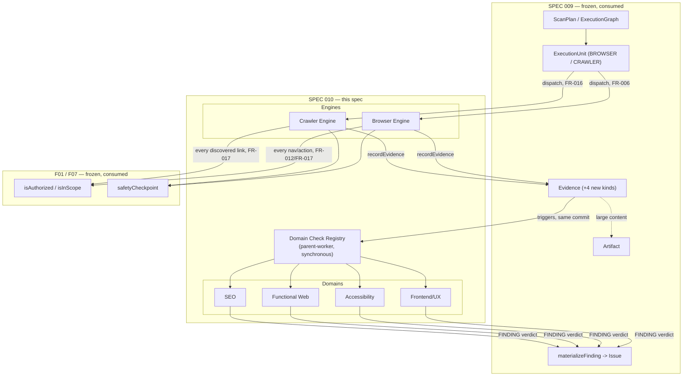
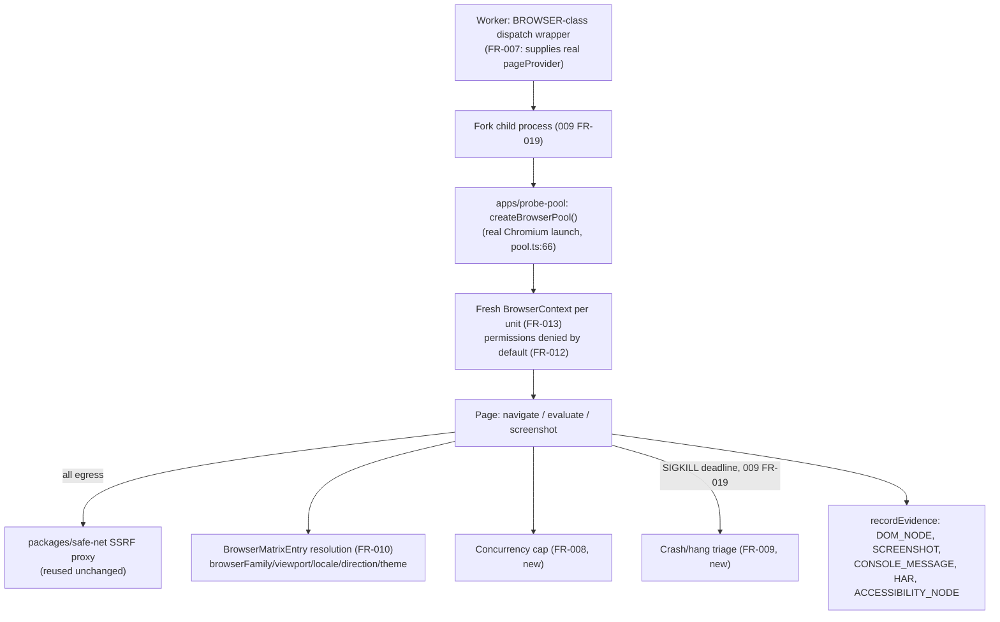
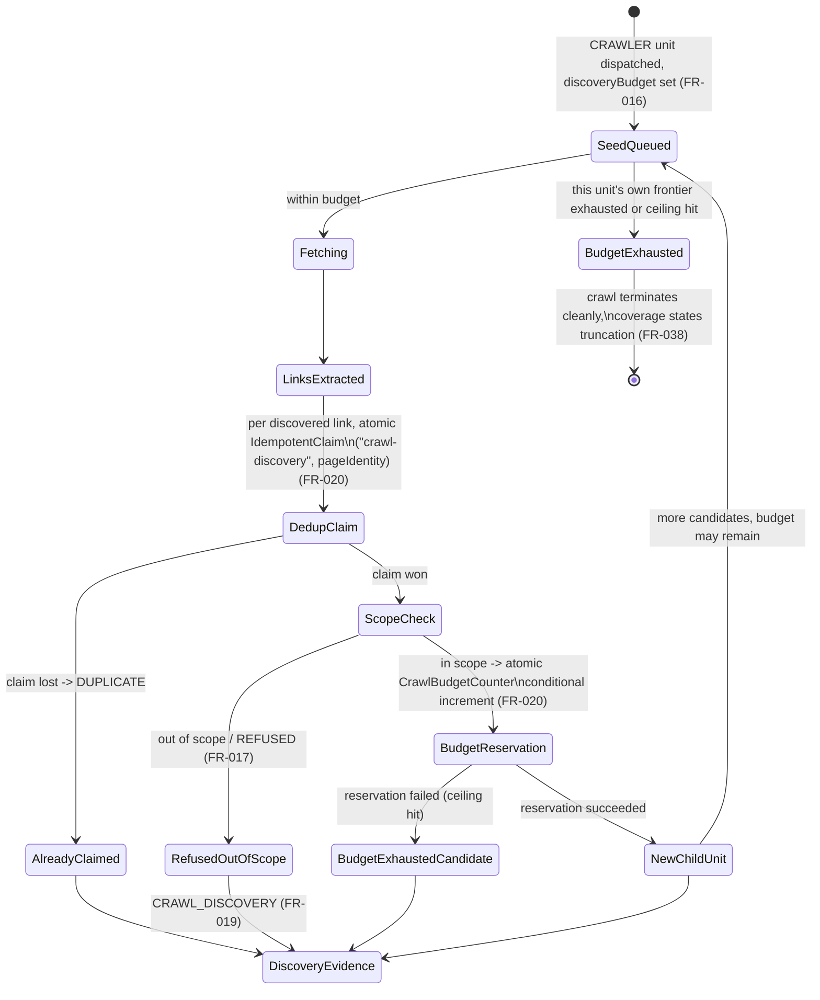
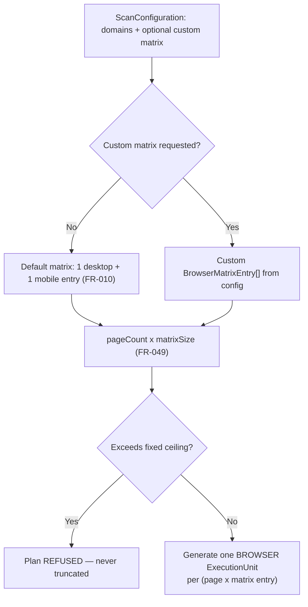
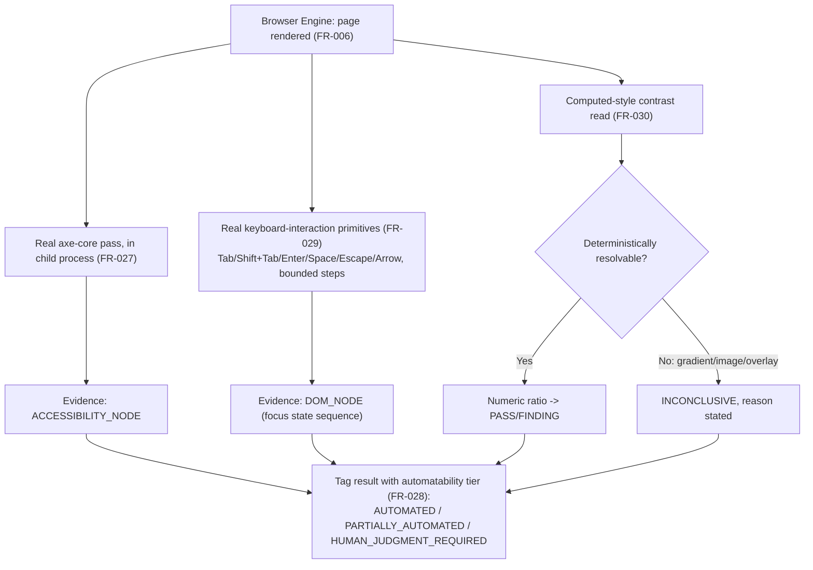
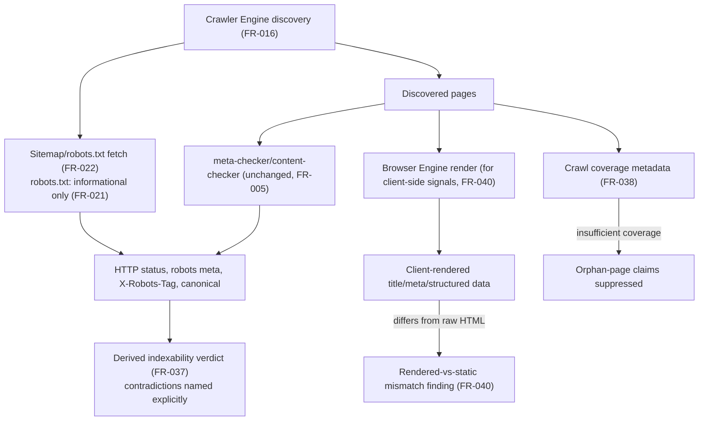
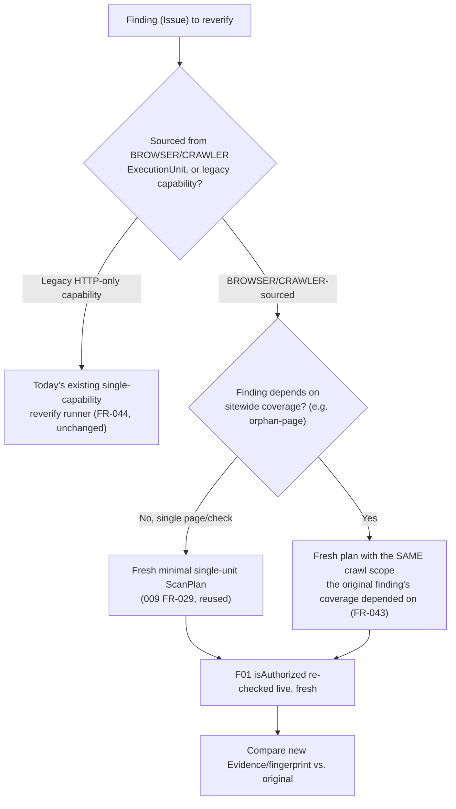

# Implementation Plan: Web / UI / Accessibility / Functional Web / SEO Testing Platform

**Branch**: `010-web-testing-platform` | **Date**: 2026-10-07 (closure pass: 2026-10-08) | **Spec**:
[spec.md](./spec.md)

**Closure-pass note**: this plan was revised alongside `spec.md`/`data-model.md`/`research.md`
during this feature's own closure pass. Where a section below was corrected rather than merely
extended, it says so inline; sections with no such note are unchanged from the original planning
pass.

**Input**: Feature specification from `specs/010-web-testing-platform/spec.md`

**Note on template fit**: like 009, this plan implements nothing — no migration runs, no
application code is written. Unlike 009 (three bounded contexts composing one backbone), this
plan's scope is two Engines and four Domains sharing that backbone; its Constitution Check and
Reuse/Extend/New Matrix are organized so a reviewer can verify each of the six areas' own boundary
discipline independently, and so every REUSE/EXTEND claim traces to one of this session's three
parallel research passes.

## Summary

This spec turns 009's generic `ExecutionUnit`/`Evidence`/`Artifact` backbone into Fahes's first
real testing capability: a Browser Engine that actually drives Chromium (reusing real, already-
tested code in `apps/probe-pool` that is today completely unwired), a Crawler Engine that actually
discovers more than one page (today's scanning is confirmed single-page/HTTP-only), and four
Domains — Frontend/UX, Accessibility, Functional Web, SEO — that consume the Evidence those two
Engines produce through a shared, generic Domain Check Registry rather than each inventing its own
evidence store or coverage model. The single hardest problem this plan resolves: how a Domain's
deterministic check reaches a Finding without becoming a new `ExecutionUnitClass` (which would
repeat exactly the frozen-sibling-enum mistake 009 itself avoided) and without becoming a private,
parallel orchestration layer (which Constitution Principle VIII forbids) — resolved by running
Domain Check dispatch as ordinary, synchronous, parent-worker-side computation triggered by each
committed `Evidence` row, entirely within this spec's own territory.

## Technical Context

**Language/Version**: Node.js >=22, TypeScript — existing monorepo standard, no new runtime.

**Primary Dependencies**: `@playwright/test` (already a real **runtime** dependency of
`apps/probe-pool/package.json`, confirmed — no new library choice needed for the browser engine);
`axe-core` (new runtime dependency this spec introduces — confirmed absent from every
`packages/capabilities-vendored/*/package.json` today; `@axe-core/playwright` exists only as
`apps/web`'s own devDependency for its internal E2E suite, an unrelated axis); `packages/safe-net`
(existing, reused for browser-level SSRF protection, already proven); 009's own `ExecutionUnit`/
`Evidence`/`Artifact` contracts (consumed, not reimplemented). No new queueing or storage
technology.

**Storage**: PostgreSQL via Prisma — four new, narrowly-scoped tables (`VisualBaseline`,
`VisualBaselineApproval`, `IdempotentClaim`, `CrawlBudgetCounter` — the first corrected and the
latter two added during this spec's own closure pass, `data-model.md` Closure Finding CF-1/
`research.md` R15/R16), two new additive `ModuleType` enum values (`ACCESSIBILITY`, `FUNCTIONAL`),
four new additive `EvidenceKind` enum values (`CONSOLE_MESSAGE`, `CRAWL_DISCOVERY`,
`STRUCTURED_DATA`, `CHECK_RESULT`) on 009's own already-extensible enum. R2 storage reuses 009's
own `Artifact` key family
(`artifacts/<scanId>/<executionUnitId>/...`) unchanged — no new storage prefix. Redis used only as
009's own existing progress/kill-switch accelerant, unchanged.

**Testing**: existing Vitest stack, extended with controlled fixture sites (per master brief §57,
not built in this planning pass) for crawl traps, redirect traps, malformed HTML, RTL layouts, and
accessibility violations — deterministic fixtures preferred over live public websites, named as a
future implementation obligation in `quickstart.md`, not designed here.

**Target Platform**: `apps/worker` (the `BROWSER`/`CRAWLER`-class dispatch wrappers, the Domain
Check Registry pass, the Evidence/Artifact writers for this spec's own new Evidence kinds) and
`apps/probe-pool` (wired in-process via a real `pageProvider`, per FR-007 — this plan does not
require `apps/probe-pool` to become its own deployed network service; in-process wiring is
sufficient and is the lower-risk default, see `research.md` R2). No new deployable unit is
*required* by this plan; a future implementation MAY still choose to deploy `apps/probe-pool` as
its own service for independent scaling, which this plan's contracts do not foreclose.

**Project Type**: foundation/testing-platform planning artifact — the first spec in this lineage
that defines actual testing logic rather than only backbone.

**Performance Goals**: N/A as a running-system target. Per master-brief §30/§45's bound (inherited
from 009): no `ExecutionUnit` dispatch may require loading every discovered page's Evidence into
memory at once (coverage summaries are computed via bounded aggregate reads, not full-evidence
scans); no single Evidence/Artifact payload may grow unboundedly (FR-010's matrix ceiling, FR-020's
crawl budget, FR-049's combinatorial-product ceiling all bound the *count* of units generated, and
009's own FR-031/FR-033 bound each unit's own Evidence/Artifact size).

**Constraints**: (1) zero behavior change to today's five existing `ModuleType` HTTP-only
capabilities/pricing/scan UX (FR-051); (2) zero `@relation` edge into any existing/frozen model
beyond the two additive enum extensions this spec's own Clarifications justify (FR-003); (3) every
`BROWSER`/`CRAWLER`-class unit calls F07's `safetyCheckpoint` exactly as 009 already requires —
this spec adds no private safety mechanism; (4) every new construct is tenant-scoped (FR-048); (5)
no AI judgment decides a coverage verdict (FR-053); (6) this spec does not widen 009's own
`ExecutionUnitClass` enum (Clarifications) — only 009's own already-extensible `EvidenceKind`.

**Scale/Scope**: four new Prisma models, two new `ModuleType` values, four new `EvidenceKind`
values, ten documented contracts, six checklists. Directly unblocks SPEC 011-014's own extension-point
requirements (master brief §39's own framing, carried forward from 009) for the one domain family
(web-facing testing) those specs do not themselves own.

## Constitution Check

*GATE: evaluated against `.specify/memory/constitution.md` v1.2.0 (Principles I-XIV), organized by
this spec's own six areas grouped into two kinds (Engines: Browser, Crawler; Domains: Frontend/UX,
Accessibility, Functional, SEO) so a reviewer can verify each independently.*

| Principle | Browser Engine | Crawler Engine | Frontend/UX | Accessibility | Functional Web | SEO |
|---|---|---|---|---|---|---|
| I. Skills Are Plugins | PASS — dispatch reaches the real browser code only through 009's `engineId`/`capabilityRef`, never a hardcoded branch. | PASS — same. | PASS — `WebCheckDefinition`s are a registry, directly analogous to today's `AuditCapability` loader (`loadCapabilities`), never a core-code switch. | PASS — same registry. | PASS — same registry; the bounded workflow catalog is itself a registered, versioned set, not inline orchestrator logic. | PASS — same registry; EXTEND of existing `meta-checker`/`content-checker` capability files, never a core-code branch. |
| II. Vendored Forever | PASS — `@playwright/test`/`axe-core` are the only new dependencies; both vendored at a pinned version per the existing capability-vendoring discipline. | PASS — no new dependency. | PASS — not applicable. | PASS — `axe-core`'s own rule set is itself vendored, not fetched at runtime. | PASS — not applicable. | PASS — not applicable. |
| III. Deterministic Before Probabilistic | PASS — Evidence production is a pure capture of what the browser actually rendered; FR-053 binds this. | PASS — discovery is deterministic traversal, no AI. | PASS — FR-024's state-testing honesty rule is this principle applied directly. | PASS — FR-028's automatability-tier honesty is this principle's own explicit extension. | PASS — FR-032's action-safety classification is deterministic, never AI-inferred. | PASS — FR-037's indexability derivation and FR-039's structured-data parse are both pure functions of evidence. |
| IV. No Single Point of AI Failure | PASS — no AI usage introduced by either Engine. | PASS — same. | PASS — AI may enrich (FR-053) but every domain's own measurement is deterministic first. | PASS — same. | PASS — same. | PASS — same. |
| V. Untrusted Code Runs Isolated | PASS — the *target's* web content is untrusted; FR-012/FR-013's browser-context isolation is this principle's own direct application to a customer's rendered page (distinct from Principle XI's bar for untrusted *customer-supplied code*, which this spec's workflows never execute — FR-031 bars `eval`/arbitrary script). | PASS — same isolation model; discovered pages are untrusted content, never executed as code. | N/A — consumes Evidence only. | N/A — same. | PASS — FR-031's closed primitive set with no `eval` is this principle's own boundary for workflow execution specifically. | N/A — consumes Evidence only. |
| VI. Metered, Reconciled Cost | PASS — FR-050 extends 009's own `costMicros` hook; no new pricing invented. | PASS — same. | PASS — not applicable directly. | PASS — not applicable directly. | PASS — not applicable directly. | PASS — not applicable directly. |
| VII. Verify Narrowly, Rescan Rarely | PASS — FR-043's fresh-minimal-plan reverify, inherited from 009's FR-029. | PASS — FR-043's one named exception (orphan-page coverage-dependent reverify) is itself narrowly scoped to exactly the findings that need it. | PASS — reverify consumes FR-043 unchanged. | PASS — same. | PASS — same. | PASS — same, plus FR-038's own "never claim orphan from insufficient coverage" discipline prevents a reverify from needing to re-litigate a claim that was never over-claimed in the first place. |
| VIII. Engines Serve Domains | PASS — this principle is FR-001's entire charter: the Browser Engine produces Evidence, never decides a Finding. | PASS — same; the Crawler Engine never becomes "SEO" itself (master brief §29's own explicit instruction). | PASS — consumes Evidence, never executes. | PASS — same. | PASS — same, even though Functional Web's own workflow *execution* happens via the Browser Engine's own primitives — the workflow's pass/fail *verdict* is still the Functional domain's own check, not the Engine's. | PASS — same. |
| IX. Evidence Is Reproducible | PASS — Evidence capture (DOM/screenshot/console/network) is deterministic given the same page state; FR-042 extends fingerprinting with matrix identity only where genuinely needed. | PASS — `CRAWL_DISCOVERY` evidence is a deterministic record of what was found. | PASS — FR-042. | PASS — same. | PASS — same. | PASS — same; FR-040's rendered-vs-static distinction is itself a reproducibility-preserving disclosure, not a reproducibility violation. |
| X. Authorization Is Not Ownership | PASS — FR-007's wiring reuses F01's existing checks unchanged; no new authorization path. | PASS — FR-017's fresh-per-link scope check is F01's own mechanism, reused, never a private crawl-scope reimplementation. | N/A | N/A | PASS — FR-032 explicitly maps workflow-step risk onto F01's existing grant model, invents no new grant type. | N/A |
| XI. Untrusted Code Isolation | PASS — explicitly distinguished from this principle's bar in this spec's own Clarifications (inherited from 009's own identical distinction for FR-019): browser-context isolation (FR-013) protects against an untrusted *page*, not untrusted Fahes-reviewed code; this spec executes no customer-supplied code. | PASS — same. | N/A | N/A | PASS — FR-031's closed primitive set is specifically what keeps Functional Web Testing *out* of this principle's heavier bar (no arbitrary script = nothing requiring container/VM-grade isolation here). | N/A |
| XII. Long-Running Work | PASS — reuses 009's own FR-017 (dedicated queue per `ExecutionUnitClass`) and FR-019 (child-process + `SIGKILL`) unchanged; FR-008/FR-009 add browser-specific concurrency/crash triage *within* that existing mechanism, never a parallel one. | PASS — same; FR-020's budget ceilings are this principle's own "bounded, not unbounded" requirement applied to crawl depth/pages. | N/A — Domain checks are short, bounded, synchronous computations over already-committed Evidence. | N/A | PASS — workflow execution itself happens inside the owning `BROWSER`-class unit's own already-isolated lifecycle; no new long-running mechanism. | N/A |
| XIII. Tenant Boundaries | PASS — FR-013/FR-048. | PASS — FR-048. | PASS — FR-048 (`VisualBaseline`). | PASS — FR-048. | PASS — FR-048. | PASS — FR-048. |
| XIV. Capability Contract | PASS — `contracts/browser-execution-contract.md` fully specifies what this Engine hands to the Domain Check Registry. | PASS — `contracts/crawler-contract.md`/`page-identity-contract.md`. | PASS — `contracts/frontend-ux-check-contract.md`. | PASS — `contracts/accessibility-check-contract.md`. | PASS — `contracts/functional-workflow-contract.md`. | PASS — `contracts/seo-check-contract.md`. |

**Gate result: PASS, no violations, across all six areas.** Complexity Tracking table is empty.

### Post-design re-check (after Phase 1)

Re-evaluated against the completed `data-model.md`/`contracts/`. The one point worth re-confirming
explicitly: does running Domain Check dispatch as parent-worker-side synchronous computation
(rather than its own `ExecutionUnit`) reopen any Principle XII "bounded, not unbounded" risk, since
it runs outside 009's own queue/dispatch mechanism entirely? **No** — a Domain Check pass over one
`ExecutionUnit`'s own just-committed Evidence is, by construction, bounded by that Evidence's own
already-bounded size (009's FR-031/FR-033) and by this spec's own fixed check-count-per-domain
ceiling (`research.md` R3) — it is a fast, synchronous, in-process computation, categorically
unlike the long-running browser/crawl work Principle XII's queue-per-class rule exists to protect
against starving. Gate result unchanged: **PASS, no violations.**

## Current-State Architecture (condensed — full evidence from this session's own three parallel
research passes, cited inline where new)

`apps/probe-pool/src/browser/pool.ts:54-122` genuinely launches Chromium, creates a fresh
`BrowserContext`+`Page` per `withPage()` call, and routes all traffic through `packages/safe-net`'s
SSRF-guarding proxy — real, tested (`apps/probe-pool/tests/adverse/browser-pool-ssrf.test.ts`), and
has **zero call sites** from `apps/worker`/`apps/api` (confirmed by direct grep). `withPage`
(`packages/capability-sdk/src/context.ts:194-201`) always rejects today because no `pageProvider`
is ever supplied. `playwright-runner` (despite its name) performs only `ctx.fetch`-based same-origin
link-checking — zero Playwright dependency in its own `package.json`. `screenshot-capture`'s
rendered-layout half, `cwv-analyzer` (entirely `withPage`-based), and `lighthouse-analyzer`'s
page-object half are all real, tested browser logic that is dead code in every current deployment
for the identical unwired-pool reason. No crawler/link-discovery capability exists at all — every
SEO/content/network capability fetches exactly one page. No accessibility-testing capability exists
for customer targets (axe-core is used only in `apps/web`'s own internal E2E suite, an unrelated
axis). `ModuleType` (`apps/api/prisma/schema.prisma:28-34`) has no `ACCESSIBILITY`/`FUNCTIONAL`
value. `apps/api/src/services/storage/reports.ts`'s R2 screenshot-storage module exists with its
own header comment confirming "nothing calls this yet." Today's pricing (`packages/config/src/
pricing.ts`) is flat per-`ModuleType` with zero per-page multiplier. `apps/worker/src/orchestrator/
orchestrator.ts`'s five-phase loop dispatches `scan -> phase -> ModuleType -> capabilities`
concurrently via `Promise.all`, single URL/workspace per scan — "this vertical slice is URL-only."

## Target Architecture

### Diagram 1 — SPEC 009 → SPEC 010 integration



### Diagram 2 — Browser/Probe architecture



### Diagram 3 — Crawler frontier lifecycle (closure-pass revision: atomic dedup/budget, not a check-then-create race)



Two concurrent discovery units racing for the identical `PageIdentity`, or racing for the last
remaining `maxPages` slot, each resolve deterministically at the single atomic statement that
owns that guarantee (`DedupClaim`'s `IdempotentClaim` row, `BudgetReservation`'s conditional
increment) — never at an application-level check-then-create sequence (`research.md` R16).

### Diagram 4 — Browser navigation + F01 scope enforcement (closure-pass revision: engine-chosen destination vs. ordinary subresource, `research.md` R13)

```mermaid
sequenceDiagram
    participant Page as Browser Page
    participant Eng as Browser/Crawler Engine
    participant F01 as F01 isInScope/isAuthorized
    participant Safe as safe-net SSRF/egress proxy
    participant F07 as F07 safetyCheckpoint
    Page->>Eng: any outbound request
    Eng->>Eng: is this an engine-chosen destination\n(top-level nav / redirect-of-nav / popup / crawl-frontier / workflow navigate)?
    alt engine-chosen destination
        Eng->>F01: isInScope(destination) — fresh, every single time (F01's own rule, reused)
        F01-->>Eng: in scope | out of scope
        alt out of scope
            Eng->>Eng: refuse; record REFUSED_OUT_OF_SCOPE (FR-017)
        else in scope
            Eng->>F07: safetyCheckpoint (009 contract, unchanged)
            F07-->>Eng: PROCEED | STOP
            alt PROCEED
                Eng->>Page: allow navigation to proceed
            else STOP
                Eng->>Eng: abort; classify per 009 FailureClass
            end
        end
    else ordinary page subresource (font/CSS/JS/image/analytics/CDN/embed)
        Eng->>Safe: route through safe-net proxy unconditionally (never F01-scope-checked)
        Safe-->>Eng: allowed | blocked (SSRF/private-IP/cloud-metadata policy, never relaxed)
    end
```

### Diagram 5 — Page → Evidence → Domain checks → Findings (closure-pass revision: readiness + idempotency gate, non-recursive by construction)

```mermaid
flowchart LR
    PAGE["One page, one BrowserMatrixEntry"] --> EV1["DOM_NODE"]
    PAGE --> EV2["SCREENSHOT"]
    PAGE --> EV3["ACCESSIBILITY_NODE"]
    PAGE --> EV4["CONSOLE_MESSAGE"]
    EV1 & EV2 & EV3 & EV4 --> CLAIM["IdempotentClaim (\"check-execution\")\nexactly-once gate per check/scope (FR-041a)"]
    CLAIM -->|claim won, evidence ready| REG["Domain Check Registry\n(web-check-registry-contract.md)"]
    CLAIM -.->|claim lost or not yet ready| SKIP["no-op — already handled or awaiting a sibling kind"]
    REG -->|dispatches by required-kind| UXCHK["Frontend/UX checks"]
    REG --> A11YCHK["Accessibility checks"]
    REG --> SEOCHK["SEO checks"]
    UXCHK & A11YCHK & SEOCHK --> RESULT["CHECK_RESULT evidence\n(PASS/FINDING/NOT_TESTED/\nUNSUPPORTED/BLOCKED/INCONCLUSIVE, FR-041)"]
    RESULT -.->|never a trigger input| CLAIM
    RESULT -->|FINDING only| MF["materializeFinding (009)"]
    MF --> ISSUE["Issue (existing, unchanged)"]
```

The dotted `RESULT -.-> CLAIM` edge is drawn to make explicit what the registry's own trigger set
*excludes*: `CHECK_RESULT` never feeds back into `CLAIM`/`REG`, which is what makes recursive self-
triggering structurally impossible (`research.md` R15).

### Diagram 6 — Responsive/browser-matrix planning



### Diagram 7 — Functional workflow execution

```mermaid
sequenceDiagram
    participant Plan as Plan Resolver (009)
    participant Cat as Workflow Catalog (FR-031)
    participant Eng as Browser Engine
    participant F01 as F01 isAuthorized
    Plan->>Cat: select applicable workflow(s) for this ScanConfiguration
    Cat->>Cat: classify each step (FR-032): READ_ONLY .. DESTRUCTIVE
    loop each step
        Cat->>F01: if step risk > LOCAL_BROWSER_MUTATION, check current authorization
        F01-->>Cat: permitted | refused
        alt permitted or READ_ONLY/LOCAL
            Cat->>Eng: execute primitive (navigate/click/fill/...)
            Eng-->>Cat: captureEvidence (DOM_NODE/CONSOLE_MESSAGE/...)
        else refused
            Cat->>Cat: skip step; record BLOCKED (FR-041)
        end
    end
    Cat->>Cat: evaluate workflow-level assertions -> CHECK_RESULT
```

### Diagram 8 — Accessibility testing flow



### Diagram 9 — SEO crawl/indexability flow



### Diagram 10 — Screenshot/visual-artifact lifecycle (closure-pass revision: pointer/history split, CF-1)

```mermaid
stateDiagram-v2
    [*] --> Captured: Browser Engine takes SCREENSHOT (FR-014)
    Captured --> StoredArtifact: createArtifact (009, unchanged)
    StoredArtifact --> PendingApproval: no VisualBaseline pointer row exists yet for (pageIdentity, matrixEntry)
    PendingApproval --> Approved: approveBaseline (FR-026) — atomic pointer upsert +\nnew VisualBaselineApproval history row
    PendingApproval --> PendingApproval: next scan's new screenshot still stored,\nstill no SCREENSHOT_DIFF finding; no extended retention
    Approved --> Diffed: next scan's new screenshot compared against the pointer's active approval
    Diffed --> Approved: user approves new screenshot;\nold approval superseded (retentionExtended cleared) in the SAME transaction
    Diffed --> [*]: SCREENSHOT_DIFF finding raised if threshold exceeded
    Approved --> Approved: active approval's Artifact excluded from\nreport-retention-parity sweep (FR-026a) while it remains active
```



### Diagram 11 — Reverify flow



### Diagram 12 — Browser crash/recovery flow

```mermaid
flowchart TD
    RUNNING["BROWSER-class unit RUNNING"] --> HANG{"Child process hangs\nor browser disconnects?"}
    HANG -->|SIGKILL deadline fires\n(009 FR-019, unchanged)| CHECKALIVE{"Was browser process\nstill alive at deadline?"}
    CHECKALIVE -->|Yes, page just hung| TIMEOUT["FailureClass: TIMEOUT (FR-009)"]
    CHECKALIVE -->|No, already disconnected| DEFECT["FailureClass: ENGINE_DEFECT (FR-009)"]
    TIMEOUT & DEFECT --> FINALIZE["finalizeExecutionUnit (009, unchanged)\nEvidence already committed is never lost\n(recordEvidence is independent of finalization, 009)"]
```

## Reuse / Extend / New Matrix

| Subsystem | Classification | Evidence | Rationale |
|---|---|---|---|
| `apps/probe-pool/src/browser/pool.ts` (Chromium launch/context/SSRF-proxy) | **REUSE-AFTER-WIRING** | Real, tested; zero call sites from `apps/worker`/`apps/api` (confirmed by grep) | FR-006/FR-007: the logic is correct, only needs a `pageProvider` supplied. |
| `packages/capability-sdk/src/context.ts`'s `withPage` | **REUSE** (interface unchanged) | `context.ts:194-201` | FR-007 closes the wiring gap on the caller side; the contract shape itself is not redesigned. |
| Browser-pool concurrency caps / crash recovery | **NEW** | Confirmed absent: single `Browser` instance, no sizing logic, no `disconnected` listener anywhere in `pool.ts` | FR-008/FR-009 — genuinely new work, not a gap in otherwise-complete code. |
| `playwright-runner` capability (link-integrity logic) | **RENAME-RECOMMENDED, logic REUSE** | `packages/capabilities-vendored/playwright-runner/src/index.ts:1-21,64-77`; zero Playwright dependency in its own `package.json` | FR-052: working code, misleading name; this spec preserves the logic, does not edit the file. |
| `screenshot-capture` (broken-image half) | **REUSE** | `src/index.ts:95-131`, HTTP-only, works today | Unaffected by this spec. |
| `screenshot-capture` (rendered-layout half) | **REUSE-AFTER-WIRING** | `src/index.ts:133-199`, real `withPage`/`page.screenshot` code, dead today | FR-006/FR-007 wiring makes this live. |
| `cwv-analyzer` | **REUSE-AFTER-WIRING** | `src/index.ts:83-150`, entirely `withPage`-based, honest about not faking metrics | Same wiring gap, inherited not introduced. |
| `lighthouse-analyzer` (header half / page-object half) | **REUSE** / **REUSE-AFTER-WIRING** | `src/index.ts:72-112` (HTTP, works) vs. `119-174` (`withPage`, dead today) | Split classification matches the file's own internal split. |
| `network-inspector` | **EXTEND** | `src/index.ts:1-20,93-193`, HTTP-only by explicit design note | Keep HTTP checks; add a browser-driven variant once the pool is wired (new `WebCheckDefinition`, not a rewrite). |
| `meta-checker` | **EXTEND** | `src/index.ts:80-162`, covers title/description/viewport/canonical only; AI prompt (`apps/worker/src/prompts/seo.ts:7-9`) claims more with zero backing code | FR-036 adds OG/robots-meta/structured-data/hreflang as new checks beside the working core. |
| `content-checker` | **REUSE**, optionally **EXTEND** | `src/index.ts:83-155` | Accurate to its name; no urgent gap. |
| `css-analyzer` | **EXTEND** | `src/index.ts:1-23,79-99,300`, static-file-based, `canRun` requires attached source | Add a rendered-computed-style variant for URL-only scans once the pool is wired; keep the static checks. |
| `impeccable` | **REUSE-AFTER-WIRING** | `src/index.ts:1-89`, AI-prompt contributor only, no `runCodeLayer`, depends on `screenshot-capture` | Becomes genuinely useful once screenshots are real. |
| Crawler / link-discovery | **NEW** | Confirmed: no such package exists under `packages/capabilities-vendored/`; every capability fetches exactly one page | FR-016 — must be built from scratch. |
| Accessibility testing (axe-core against a customer target) | **NEW** | Confirmed: zero capability exists; `@axe-core/playwright` is `apps/web`'s own internal dev-QA tool, unrelated | FR-027 — must be built from scratch. |
| sitemap.xml / robots.txt parsing | **NEW** | Confirmed: zero parsing code anywhere; only prose in an AI prompt | FR-022 — must be built from scratch. |
| `ModuleType` enum | **EXTEND** (additive values only) | `apps/api/prisma/schema.prisma:28-34` | FR-003 — the one schema touch this spec makes, justified in Clarifications. |
| `Capability`/`CapabilityExecution` | **REUSE**, unchanged | `schema.prisma:637-667,683-707` | FR-005 parity; today's five HTTP-only capabilities keep using this path untouched. |
| `Issue`/fingerprinting | **REUSE**, unchanged mechanism | `packages/scoring/src/fingerprint.ts:67-72`; `Issue.location` plain string, `schema.prisma:574` | FR-042 adds to `fingerprintParts` content only, never to the mechanism or `Issue`'s schema. |
| `@webaudit/redaction` | **REUSE**, scope extended by this spec's own obligation (not the library's own code) | `packages/redaction/src/{index,detect}.ts` | FR-045 — this spec requires its own call sites to invoke it for Evidence kinds 009's own class list does not cover. |
| `apps/api/src/services/storage/reports.ts` (R2 screenshot storage) | **REUSE-AFTER-WIRING**, via 009's own `Artifact`/`createArtifact`, not this module directly | `reports.ts:1-40`, header comment confirms zero current call sites | FR-014: this spec routes screenshots through 009's own `Artifact` contract, not this pre-existing, unconsumed module — no second screenshot storage system (master brief's own explicit instruction). |
| `apps/worker/src/reverify/runner.ts` | **REUSE**, unchanged, for legacy findings only | Confirmed real, single-capability reverify | FR-044 parity; FR-043 defines the new path for `ExecutionUnit`-sourced findings specifically. |
| `packages/config/src/pricing.ts` | **UNTOUCHED** (out of scope) | `pricing.ts:1-61`, flat per-module, zero per-page multiplier | FR-050 names the budget *mechanism* only; pricing itself is out of scope. |
| `apps/web/components/scan/ScanForm.tsx` | **UNTOUCHED** (out of scope) | `ALL_AREAS` selection only, no per-page/browser/viewport picker | This spec defines contracts a future richer UX would consume; it does not redesign the UI. |
| `VisualBaseline` (closure-pass fix) | **NEW** (corrected from an infeasible first draft) | `data-model.md` Closure Finding CF-1 | The original single-table design's `@@unique` could not coexist with retained history; split into pointer + `VisualBaselineApproval`. |
| `IdempotentClaim` | **NEW** | `research.md` R15/R16 | One generic claim-once primitive, reused for check-execution idempotency, crawl-discovery dedup, and workflow-step idempotency — added during this spec's closure pass to replace prose that described no feasible mechanism. |
| `CrawlBudgetCounter` | **NEW** | `research.md` R16 | The one atomic, bounded counter `maxPages` needs to stay race-safe under concurrent discovery workers. |

## Domain / Engine Matrix (FR-004)

| Domain (`ModuleType`) | Requires `BROWSER`? | Requires `CRAWLER`? | Legacy `PASSIVE_HTTP` checks retained? |
|---|---|---|---|
| `UI` (Frontend/UX) | Yes, for every structural/visual check | Only if multi-page responsive coverage requested | `screenshot-capture`'s broken-image half |
| `ACCESSIBILITY` (new) | Yes, always (axe-core needs a render) | Only for sitewide accessibility coverage | None (genuinely new domain) |
| `FUNCTIONAL` (new) | Yes, always (workflow primitives need a page) | No | None (genuinely new domain) |
| `SEO` | Only for rendered/client-side checks (FR-040) | Yes, for sitemap/internal-link/orphan checks | `meta-checker`/`content-checker` (unchanged) |

## ModuleType Activation Touchpoints (FR-003a — added during this spec's closure pass)

Adding `ACCESSIBILITY`/`FUNCTIONAL` to `ModuleType` is additive and safe (FR-003, `research.md`
R1), but it does **not**, by itself, make either domain operational. A future implementation MUST
separately update, before either value may appear in a real priced scan:

| Touchpoint | Current state | What must change |
|---|---|---|
| `packages/config/src/pricing.ts` `AREA_COST` | Flat per-module map, five entries, confirmed no `ACCESSIBILITY`/`FUNCTIONAL` key | Add a priced entry for each, or an explicit decision that they ship bundled into an existing area's price |
| `apps/web/components/scan/ScanForm.tsx` `ALL_AREAS` | Five-value array, confirmed unchanged by this spec (FR-051) | Add the two new values once a scan-creation UX for them exists (not designed here) |
| Any exhaustive `switch`/lookup over `ModuleType` in scoring/readiness/report-rendering code with no default branch | Not exhaustively enumerated by this spec's own research passes | A future implementation's own obligation to grep for and update every such call site — this spec does not claim to have found them all |
| AI-prompt-assembly registry (`apps/worker/src/prompts/`) | No `ACCESSIBILITY`/`FUNCTIONAL` prompt module exists | Add one only if/when either domain's AI-layer contribution (UX critique, remediation guidance) is wired in — not required for the deterministic code-layer checks themselves to work |

This table exists so a future reader cannot mistake "the enum values exist in the schema" for "the
domains are active in production" — FR-051's own strict-parallel-run guarantee already covers the
schema touch itself; this section covers everything *beyond* the schema that activation requires.

## Browser/Crawler Safety Model

See `contracts/browser-execution-contract.md`/`crawler-contract.md` for the full threat-model
walkthrough. Summary: SSRF/DNS-rebinding/localhost/private-IP/cloud-metadata egress is already
closed by the existing, proven `packages/safe-net` proxy (reused unchanged) for **every** request
this platform's engines make, navigation and subresource alike. F01's scope/authorization check is
a narrower, separate obligation applying only to **engine-chosen destinations** (top-level
navigation, redirect-of-navigation, popups, crawl-frontier expansion, workflow `navigate` steps) —
resolved precisely against F01's own frozen text during this spec's closure pass (`research.md`
R13), since a literal word-for-word reading of F01's own illustrative "loads a cross-origin
resource" language would otherwise require scope-checking every ordinary page subresource and
break normal rendering of almost any real site. This plan's own new obligations remain: browser-
context-level (permissions-denied-by-default, no cross-tenant state persistence, popup/download/
service-worker policy, FR-012/FR-013) and crawler-level (budget-bounded frontier via `Crawl
BudgetCounter`'s atomic reservation, `PageIdentity`-based dedup via `IdempotentClaim` closing
query-explosion/calendar traps race-safely, redirect-hop/response-size ceilings, FR-020).

## Crash/Recovery Model

Inherits 009's own idempotent finalization and `SIGKILL`-deadline mechanism unchanged. This spec's
own addition is purely classificatory (FR-009): distinguishing a hung-but-alive browser process
(`TIMEOUT`) from an already-disconnected one (`ENGINE_DEFECT`) so an operator's own triage is
accurate, never inventing a second recovery mechanism.

## Coverage Model

FR-041's six-value taxonomy (`PASS`/`FINDING`/`NOT_TESTED`/`UNSUPPORTED`/`BLOCKED`/`INCONCLUSIVE`),
recorded uniformly as `CHECK_RESULT` Evidence for every check execution regardless of domain —
extends 009's own `scanCoverageSummary` (unit-level: what ran) one level down to check-level (what
was actually decided, and how confidently). FR-041a (added during this spec's closure pass) closes
the lifecycle that produces these records: readiness is scope-keyed per check (`readinessScope`),
execution is idempotency-claim-gated (`IdempotentClaim`, exactly-once per identity under retry/
replay/concurrency), `CHECK_RESULT` is permanently excluded from the registry's own trigger set
(non-recursion by construction), and a plan-finalization sweep guarantees every requested check
ends with a recorded verdict — never silently with none at all.

## Current-Production Compatibility Strategy

FR-051, restated: zero behavior change to today's five existing `ModuleType` values' dispatch,
pricing, or scan-creation UX. See the "SPEC 009 → SPEC 010 integration" diagram's own implicit
boundary: nothing in this spec's own new machinery (Engines, Domain Check Registry, `VisualBaseline`)
sits on today's existing `CapabilityExecution` path at all — it is a wholly parallel, additive track
until an explicit future cutover decision.

## Reverify Compatibility

FR-043/FR-044: `ExecutionUnit`-sourced findings get a fresh, minimal plan (009's own FR-029,
reused) with the one named exception — a coverage-dependent finding (an orphan-page SEO finding)
reverifies with the **minimum** crawl scope necessary to reproduce its original coverage claim,
closure-pass-tightened wording for precisely this reason: neither blindly reusing the original
crawl's own now-possibly-stale evidence, nor blindly rescanning more broadly than the claim itself
requires. A reverify that cannot obtain a fresh, sufficient-coverage result resolves `REFUSED`
rather than silently narrowing to a check that cannot actually reproduce what it claims to verify.
Legacy HTTP-only findings keep using today's unchanged single-capability reverify runner.

## Future-Spec Extension Points

SPEC 011 (Source/Backend) may reuse this spec's `Evidence`/coverage taxonomy for its own
deterministic checks without needing browser/crawl infrastructure. SPEC 012 (Active Security) may
consume this spec's `BrowserMatrixEntry`/page-identity/scope-check machinery when it needs to drive
a browser against an authenticated session, but owns its own attack-payload logic entirely outside
this spec. SPEC 013 (Performance/Load) consumes this spec's own navigation/resource-timing Evidence
hooks (already present via `HAR`/`BROWSER_TRACE`) without this spec designing any load/capacity
logic. SPEC 014 (Production Readiness) consumes this spec's coverage taxonomy (FR-041) as one input
to its own, not-designed-here, readiness scoring.

## Independent Adversarial Review

See `research.md`'s own dedicated section for the full scenario-by-scenario walkthrough.

## Project Structure

### Documentation (this feature)

```text
specs/010-web-testing-platform/
├── spec.md
├── checklists/
│   ├── requirements.md
│   ├── browser-crawler-safety.md
│   ├── frontend-functional-correctness.md
│   ├── accessibility-coverage-honesty.md
│   ├── seo-correctness-coverage.md
│   └── tenant-privacy-evidence-security.md
├── plan.md                     # This file
├── research.md
├── data-model.md
├── contracts/
│   ├── browser-execution-contract.md
│   ├── crawler-contract.md
│   ├── page-identity-contract.md
│   ├── web-check-registry-contract.md
│   ├── accessibility-check-contract.md
│   ├── frontend-ux-check-contract.md
│   ├── functional-workflow-contract.md
│   ├── seo-check-contract.md
│   ├── visual-baseline-contract.md
│   └── coverage-contract.md
├── quickstart.md
└── tasks.md
```

### Source Code (repository root)

Not applicable to this planning pass. When a future session implements this spec: the
`BROWSER`/`CRAWLER`-class dispatch wrappers land in `apps/worker/src/execution-runtime/` (per 009's
own named landing spot), the Domain Check Registry in a new `apps/worker/src/web-checks/`
directory, `apps/probe-pool`'s wiring change is a small edit to the dispatch wrapper's own
construction of `CodeLayerContext.options.pageProvider`, and one new Prisma migration adds
`VisualBaseline` plus the two `ModuleType`/four `EvidenceKind` enum values.

**Structure Decision**: documentation-only for this planning pass — no source tree created or
modified.

## Complexity Tracking

*No entries — the Constitution Check above found zero violations requiring justification.*
